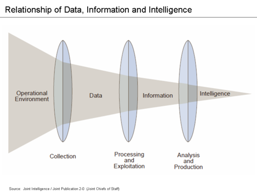

## What is Data Analysis?  
> -  A process of inspecting, cleansing, transforming, and modeling data with the goal of discovering useful information, suggesting conclusions, and supporting decision-making.  
> - Data Analysis Facets.  
    * 描述性统计分析(Descriptive Statistics Analysis) & 推断式分析(Inferential Statistics Analysis)
    * 探索性数据分析(Exploratory Data Analysis (EDA)) &  验证性数据分析(Confirmatory Data Analysis (CDA)) 
    * Univariate / Bivariate / Multivariate Analysis
    * Predictive Analytics  

--- .smaller  

## Data Mining and Machine Learning  
> - Data mining is a particular data analysis technique that focuses on modeling and knowledge discovery for predictive.  
> - Data mining is the analysis step of the "knowledge discovery in databases" process, or KDD  
> - Machine Learning  
    * subfield of computer science  
    * gives "computers the ability to learn without being explicitly programmed  
    * explores the study and construction of algorithms that can learn from and make predictions on data  

--- .smaller

##  Data Related Terms  


--- class #id 

## Data Science Process  
  

--- class #id  

## Data,Information and Intelligence  
 

--- &twocol

## Data Science EcoSystem  
*** =left  

> - Databases    
    * RDBMS  
    * NoSQL  
> - Big Data Platform    
    * Map-Reduced based    
    * Streamed Computing   
    * Iterable Computing  
    * MPP  

*** =right  

> - Tools  
    * ETL tools    
    * Matlab, Octave  
    * R, Python  
    * SPSS, SAS  
    * RapidMiner, KNIME  

--- class #id

## Visulization  
```{r echo=F,warning=F,message=F,fig.height=7,fig.width=12}
par(mfrow=c(2, 3))

# Scatterplot
x <- c(0.5, 2, 4, 8, 12, 16)
y1 <- c(1, 1.3, 1.9, 3.4, 3.9, 4.8)
y2 <- c(4, .8, .5, .45, .4, .3)
par(las=1, mar=c(4, 4, 2, 4), cex=.7)
plot.new()
plot.window(range(x), c(0, 6))
lines(x, y1)
lines(x, y2)
points(x, y1, pch=16, cex=2)
points(x, y2, pch=21, bg="white", cex=2)
par(col="gray50", fg="gray50", col.axis="gray50")
axis(1, at=seq(0, 16, 4))
axis(2, at=seq(0, 6, 2))
axis(4, at=seq(0, 6, 2))
box(bty="u")
mtext("Travel Time (s)", side=1, line=2, cex=0.8)
mtext("Responses per Travel", side=2, line=2, las=0, cex=0.8)
mtext("Responses per Second", side=4, line=2, las=0, cex=0.8)
text(4, 5, "Bird 131")
par(mar=c(5.1, 4.1, 4.1, 2.1), col="black", fg="black", col.axis="black")

# Histogram
# Random data
Y <- rnorm(50)
# Make sure no Y exceed [-3.5, 3.5]
Y[Y < -3.5 | Y > 3.5] <- NA
x <- seq(-3.5, 3.5, .1)
dn <- dnorm(x)
par(mar=c(4.5, 4.1, 3.1, 0))
hist(Y, breaks=seq(-3.5, 3.5), ylim=c(0, 0.5), 
     col="gray80", freq=FALSE)
lines(x, dnorm(x), lwd=2)
par(mar=c(5.1, 4.1, 4.1, 2.1))

# Barplot
# Modified from example(barplot)
par(mar=c(2, 3.1, 2, 2.1))
midpts <- barplot(VADeaths, 
                  col=gray(0.5 + 1:5/12), 
                  names=rep("", 4))
mtext(sub(" ", "\n", colnames(VADeaths)),
      at=midpts, side=1, line=0.5, cex=0.5)
text(rep(midpts, each=5), apply(VADeaths, 2, cumsum) - VADeaths/2,
     VADeaths, 
     col=rep(c("white", "black"), times=2:3), 
     cex=0.8)
par(mar=c(5.1, 4.1, 4.1, 2.1))

# Boxplot
# Modified example(boxplot) - itself from suggestion by Roger Bivand
par(mar=c(3, 4.1, 2, 0))
     boxplot(len ~ dose, data = ToothGrowth,
             boxwex = 0.25, at = 1:3 - 0.2,
             subset= supp == "VC", col="gray90",
             xlab="",
             ylab="tooth length", ylim=c(0,35))
     mtext("Vitamin C dose (mg)", side=1, line=2.5, cex=0.8)
     boxplot(len ~ dose, data = ToothGrowth, add = TRUE,
             boxwex = 0.25, at = 1:3 + 0.2,

             subset= supp == "OJ")
     legend(1.5, 9, c("Ascorbic acid", "Orange juice"), 
            fill = c("gray90", "gray70"), 
            bty="n")
par(mar=c(5.1, 4.1, 4.1, 2.1))

# Persp
# Almost exactly example(persp)
    x <- seq(-10, 10, length= 30)
     y <- x
     f <- function(x,y) { r <- sqrt(x^2+y^2); 10 * sin(r)/r }
     z <- outer(x, y, f)
     z[is.na(z)] <- 1
# 0.5 to include z axis label
par(mar=c(0, 0.5, 0, 0), lwd=0.5)
     persp(x, y, z, theta = 30, phi = 30, 
 
           expand = 0.5)
par(mar=c(5.1, 4.1, 4.1, 2.1), lwd=1)

# Piechart
# Example 4 from help(pie)
par(mar=c(0, 2, 1, 2), xpd=FALSE, cex=0.5)
     pie.sales <- c(0.12, 0.3, 0.26, 0.16, 0.04, 0.12)
     names(pie.sales) <- c("Blueberry", "Cherry",
         "Apple", "Boston Cream", "Other", "Vanilla")
     pie(pie.sales, col = gray(seq(0.4,1.0,length=6))) 


```

--- .class #id
## Business Model  
> - Data as a Service  
> - Information as a Service  
> - Answer as a Service  

--- .class #id 

## Data Analysis Approach  

> - Classical Method 
> - Exploratory Data Analysis 
> - Bayesian Analysis 
> - Methdology  
    - CRISP-DM  
    - SEMMA  

--- .class #id
## CRISP-DM  
> - CRISP-DM : CRISP-DM (cross-industry standard process for data mining), 即为"跨行业数据挖掘过程标准".  
    * business understanding-- 业务理解  
    * data understanding-- 数据理解  
    * data preperation-- 数据准备  
    * modeling-- 建立模型  
    * evaluation-- 评价  
    * deployment-- 部署 

--- .nighty  
## SEMMA  
> - SEMMA : Sample, Explore, Modify, Model, and Assess
    * Sample  ── 数据取样
    * Explore ── 数据特征探索、分析和预处理  
    * Modify  ── 问题明确化、数据调整和技术选择  
    * Model   ── 模型的研发、知识的发现  
    * Assess  ── 模型和知识的综合解释和评价 

--- .class #id  

## CRISP-DM VS SEMMA
> - CRISP-DM是从一个数据挖掘项目执行的角度谈方法论,  
    SEMMA 则是从对具体某个数据集的一次探测和挖掘的角度来谈方法论,   
    CRISP- DM的考虑的范围比SEMMA要大。CRISP-DM关注商业目标、数据的获取和管理, 以及模型在商业背景下的有效性。   
> - CRISP- DM认为数据挖掘是由商业目标驱动的，同时重视数据的获取、净化和管理;  
    SEMMA 不否认商业目标，但更强调数据挖掘是一个探索的过程，在最终确定模式和模型前, 要经过充分的探索和比较。 
> - 哪种方法占主流?  

--- .bigger  

## Question : What a good data analysis come from?  

> - <q> A good data analysis come from a good __question__.</q>


