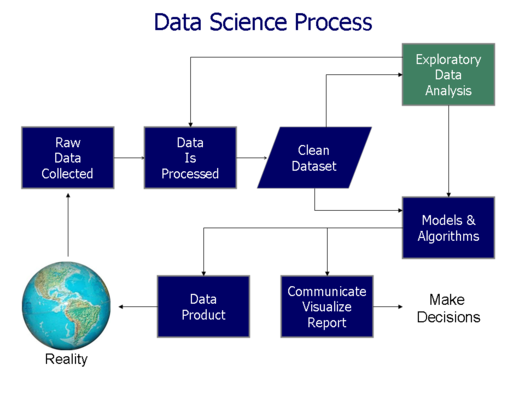
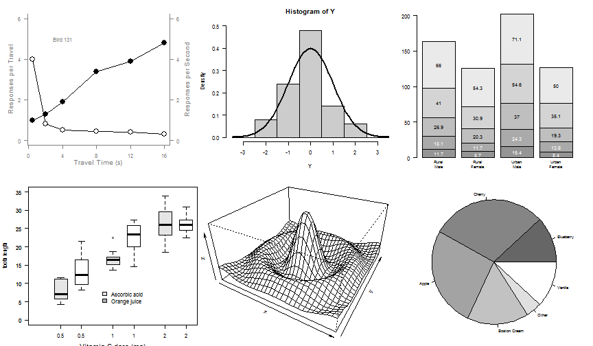

## What is Data Analysis?  
> -  A process of inspecting, cleansing, transforming, and modeling data with the goal of discovering useful information, suggesting conclusions, and supporting decision-making.  
> - Data Analysis Facets.  
    * 描述性统计分析(Descriptive Statistics Analysis) & 推断式分析(Inferential Statistics Analysis)
    * 探索性数据分析(Exploratory Data Analysis (EDA)) &  验证性数据分析(Confirmatory Data Analysis (CDA)) 
    * Univariate / Bivariate / Multivariate Analysis
    * Predictive Analytics  

--- .smaller  

## Data Mining and Machine Learning  
> - Data mining is a particular data analysis technique that focuses on modeling and knowledge discovery for predictive.  
> - Data mining is the analysis step of the "knowledge discovery in databases" process, or KDD  
> - Machine Learning  
    * subfield of computer science  
    * gives "computers the ability to learn without being explicitly programmed  
    * explores the study and construction of algorithms that can learn from and make predictions on data  

--- .smaller

##  Data Related Terms  

--- class #id 

## Data Science Process  
  

--- class #id  

## Data,Information and Intelligence  
 

--- &twocol

## Data Science EcoSystem  
*** =left  

> - Databases    
    * RDBMS  
    * NoSQL  
> - Big Data Platform    
    * Map-Reduced based    
    * Streamed Computing   
    * Iterable Computing  
    * MPP  

*** =right  

> - Tools  
    * ETL tools    
    * Matlab, Octave  
    * R, Python  
    * SPSS, SAS  
    * RapidMiner, KNIME  

--- class #id

## Visulization  

--- .class #id
## Business Model  
> - Data as a Service  
> - Information as a Service  
> - Answer as a Service  

--- .class #id 

## Data Analysis Approach  

> - Classical Method 
> - Exploratory Data Analysis 
> - Bayesian Analysis 
> - Methdology  
    - CRISP-DM  
    - SEMMA  

--- .class #id
## CRISP-DM  
> - CRISP-DM : CRISP-DM (cross-industry standard process for data mining), 即为"跨行业数据挖掘过程标准".  
    * business understanding-- 业务理解  
    * data understanding-- 数据理解  
    * data preperation-- 数据准备  
    * modeling-- 建立模型  
    * evaluation-- 评价  
    * deployment-- 部署 

--- .nighty  
## SEMMA  
> - SEMMA : Sample, Explore, Modify, Model, and Assess
    * Sample  ── 数据取样
    * Explore ── 数据特征探索、分析和预处理  
    * Modify  ── 问题明确化、数据调整和技术选择  
    * Model   ── 模型的研发、知识的发现  
    * Assess  ── 模型和知识的综合解释和评价 

--- .class #id  

## CRISP-DM VS SEMMA
> - CRISP-DM是从一个数据挖掘项目执行的角度谈方法论,  
    SEMMA 则是从对具体某个数据集的一次探测和挖掘的角度来谈方法论,   
    CRISP- DM的考虑的范围比SEMMA要大。CRISP-DM关注商业目标、数据的获取和管理, 以及模型在商业背景下的有效性。   
> - CRISP- DM认为数据挖掘是由商业目标驱动的，同时重视数据的获取、净化和管理;  
    SEMMA 不否认商业目标，但更强调数据挖掘是一个探索的过程，在最终确定模式和模型前, 要经过充分的探索和比较。 
> - 哪种方法占主流?  

--- .bigger  

## Question : What a good data analysis come from?  

> - <q> A good data analysis come from a good __question__.</q>

