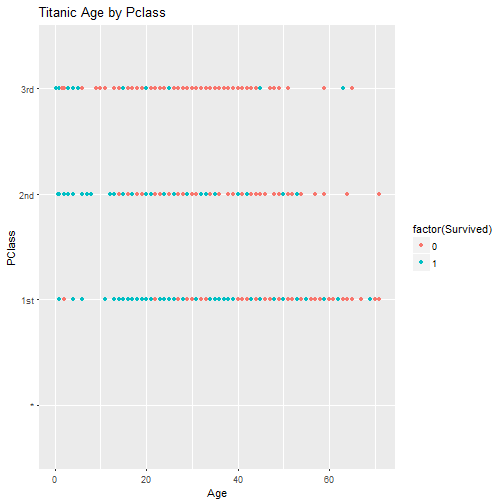

## Question 1 ?  
Martin在三年的数学学习中，共参加了10次考试，成绩如下：  
 {95，96，100，98，100，97，99，100，96，90}  
> - 我们应该如何描述他的成绩？  
> - 试着预测他下次的成绩。  
> - 第二个96改成69，再尝试回答上两个问题。 
> - 可以用更直观的方式描述他的成绩吗?  

--- &twocol  
## Story 1 :  Airquality Dataset  
*** =left  
Martin毕业到环境保护组织成为了一名数据分析师。
AirQuality Dataset

| Ozone| Solar.R| Wind| Temp| Month| Day|
|-----:|-------:|----:|----:|-----:|---:|
|    41|     190|  7.4|   67|     5|   1|
|    36|     118|  8.0|   72|     5|   2|
|    12|     149| 12.6|   74|     5|   3|
|    18|     313| 11.5|   62|     5|   4|
|    NA|      NA| 14.3|   56|     5|   5|
|    28|      NA| 14.9|   66|     5|   6|
> - 领导对他说：“我们应该了解一下臭氧污染的情况呀“.
*** =right  
> -  histogram


--- .class #id 
## 第二天...  
> - 有没有更细化一些的  
> - Histogram plus KDE    


--- .class #id
## 第三天...  
- 能不能有实际的数字呀，最好也有风速、温度之类的  
  
  
- Five Number  
  

|   |    Ozone      |   Solar.R    |     Wind      |     Temp     |    Month     |     Day     |
|:--|:--------------|:-------------|:--------------|:-------------|:-------------|:------------|
|   |Min.   :  1.00 |Min.   :  7.0 |Min.   : 1.700 |Min.   :56.00 |Min.   :5.000 |Min.   : 1.0 |
|   |1st Qu.: 18.00 |1st Qu.:115.8 |1st Qu.: 7.400 |1st Qu.:72.00 |1st Qu.:6.000 |1st Qu.: 8.0 |
|   |Median : 31.50 |Median :205.0 |Median : 9.700 |Median :79.00 |Median :7.000 |Median :16.0 |
|   |Mean   : 42.13 |Mean   :185.9 |Mean   : 9.958 |Mean   :77.88 |Mean   :6.993 |Mean   :15.8 |
|   |3rd Qu.: 63.25 |3rd Qu.:258.8 |3rd Qu.:11.500 |3rd Qu.:85.00 |3rd Qu.:8.000 |3rd Qu.:23.0 |
|   |Max.   :168.00 |Max.   :334.0 |Max.   :20.700 |Max.   :97.00 |Max.   :9.000 |Max.   :31.0 |
|   |NA's   :37     |NA's   :7     |NA             |NA            |NA            |NA           |

--- &twocol
##  第四天  
*** =left  

臭氧和季节有什么关系吗  
> - BarPlot  


*** =right  

> - 臭氧和温度有什么关系吗  
> - ScatterPlot


--- .class #id
可否展示所有数值变量之间的关系呢？ 
> - Pairplot  


--- .class #id
## Story 2 : What's the problem?  


--- .class #id
### 为什么认为Lanton会赢得大选？  
> 1. 回顾事件：
    Literary Digest调查其1M读者，统计得到有43%的人支持罗斯福，所以Literary Digest得出结论：罗斯福会以大约43%的支持度而败选。而实际结果是罗斯福以62%的选票胜出。Literary Digest因为此事失去信用度，在很短的时间内就被迫停业了。  

> 2. 审查统计推断过程  
    - 总体是美国选民，样本是1M读者，$n=1M$  
    - 这里我们关心的随机变量是美国选民支持罗斯福比例，记为 $p$。
    - 参数估计 $p$ ：Point Estimate $\hat{p}$ 和 Confidence Interval  
    - Question 1 ? : $p$ 是什么分布呢？  
    - Question 2 ? : 抽样分布是什么分布呢。
    

--- .class #id
### 继续  
> - Answer 1 : $p$ 是二项式分布
> - Answer 2 : 根据CLT，抽样分布是正态分布
> - 给定置信水平为0.95，$\hat{p}=0.43$  
    $CI = \hat{p} \pm Z^* \times \sqrt{\frac{p(1-p)}{n}}$
> - Wald Interval : $Margin\ errors <1/\sqrt{n}=0.001$  
    得到 $CI = (0.429,0.431)$
> - 显然置信区间不包括50%。也就是说从数据上看，我们95%相信罗斯福的支持率在42.9%到43.1%之间。 
> - 即使把置信水平提高到99%，我们也会得出几乎一样的结论。
> - 那么意味着从统计推断来看没有问题，竞选结果说明我们遇到了第一类错误，一个非常小概率的事情发生了。 

--- .class #id
## 结论  
最后，我们需要审查数据收集过程。  
> - 仔细分析后，不难发现抽样过程存在问题。
> - Literary Digest采样的是它的读者，不是从所有美国选民中随机采样。事实上，该杂志读者相对收入和地位较高。所以问题出在采样偏差上。 
> - 我们从中学到了什么: 数据收集过程至关重要！！！
> - Garbage in Garbage out.  

--- .class
## Story 3 : 泰坦尼克号上获救的人是否完全随机呢？
  
Titanic DataSet  
  

|  X|Name                                          |PClass |   Age|Sex    | Survived| SexCode|
|--:|:---------------------------------------------|:------|-----:|:------|--------:|-------:|
|  1|Allen, Miss Elisabeth Walton                  |1st    | 29.00|female |        1|       1|
|  2|Allison, Miss Helen Loraine                   |1st    |  2.00|female |        0|       1|
|  3|Allison, Mr Hudson Joshua Creighton           |1st    | 30.00|male   |        0|       0|
|  4|Allison, Mrs Hudson JC (Bessie Waldo Daniels) |1st    | 25.00|female |        0|       1|
|  5|Allison, Master Hudson Trevor                 |1st    |  0.92|male   |        1|       0|
|  6|Anderson, Mr Harry                            |1st    | 47.00|male   |        1|       0|
|  7|Andrews, Miss Kornelia Theodosia              |1st    | 63.00|female |        1|       1|
|  8|Andrews, Mr Thomas, jr                        |1st    | 39.00|male   |        0|       0|
|  9|Appleton, Mrs Edward Dale (Charlotte Lamson)  |1st    | 58.00|female |        1|       1|
| 10|Artagaveytia, Mr Ramon                        |1st    | 71.00|male   |        0|       0|

--- &twocol
### 舱位等级与年龄    

*** =left  

> - 年龄和舱位等级有关系吗

  
*** =right  
  
> - 获救的人和年龄或者舱位等级有关系吗？ 


--- .class #id
### 获救的人和性别有关系吗？
  


--- .class #id
### 多个变量的关系   


--- .class #id
## Z-test for class   

$H_0$ : 不同舱位等级，其获救率无显著性区别  
$H_1$ : 头等舱有更大的机会获救    


总体有34.37%的人获救。
头等舱共322人，有59.94%的人获救。 
  
  
> - $Z^*=\frac{0.5994-0.3437}{\sqrt{0.3437\times(1-0.3437)/322}}=9.66$


--- .class #id  

## Chi-Square Test between Survived Sex

```
## Chi-Square test for Survived and Sex
```

```
##    
##     female male
##   0    154  709
##   1    308  142
```

```
## 
## 	Pearson's Chi-squared test with Yates' continuity correction
## 
## data:  titan$Survived and titan$Sex
## X-squared = 329.84, df = 1, p-value < 2.2e-16
```

--- .class #id
# Chi-Square Test between Survived and Pclass

```
## Chi-Square test for Survived and Pclass
```

```
##    
##       * 1st 2nd 3rd
##   0   1 129 160 573
##   1   0 193 119 138
```

```
## Number of cases in table: 1313 
## Number of factors: 2 
## Test for independence of all factors:
## 	Chisq = 173.1, df = 3, p-value = 2.72e-37
## 	Chi-squared approximation may be incorrect
```

--- &twocol
## Case for Anova   
一个教育学者比较学生在不同教育组织在线学习的效率，她分别调查了World Campus,University Park 和CommonWealth campus共327个学生。  

*** =left  
  
level|N|mean|StDev
---|---|---|---
Commonwealth Campus|170|100.44|16.90
University Park|69|103.72|14.77
World Campus|88|113.09|13.34  
  
> - 学习效率分数成近似正态分布  
> - $H_0 : \mu_{CC} = \mu_{UP} = \mu_{WC}$  
    $H_1$ : Not all $\mu$ are equal  

*** =right  
  
source|df|SS|MS|F|P
---|---|---|---|---|---
Campus|2|9345|4672|19.27|0.000
Error|324|78569|242
Total|326|87914  
  
> - p < 0.001  
> - 我们认为其均值不全相同。 

--- &twocol  
## Case for 回归问题 (Regression Analysis)
*** =left
> - 问题：已知钻石的重量，如何预测钻石的价格？  


*** =right  
> - 回归系数  
        $\hat \beta_0 = \bar Y - \hat \beta_1 \bar X$  
        $\hat \beta_1 = Cor(Y, X) \frac{Sd(Y)}{Sd(X)}$  
        $\sigma_{\hat \beta_1}^2 = Var(\hat \beta_1) = \sigma^2 / \sum_{i=1}^n (X_i - \bar X)^2$  
        $\sigma_{\hat \beta_0}^2 = Var(\hat \beta_0)  = \left(\frac{1}{n} + \frac{\bar X^2}{\sum_{i=1}^n (X_i - \bar X)^2 }\right)\sigma^2$  
        $\frac{\hat \beta_j - \beta_j}{\hat \sigma_{\hat \beta_j}}\sim t(n-2)$


--- .class #id
## 回归系数讨论    

  
  

```
##              Estimate Std. Error   t value     Pr(>|t|)
## (Intercept) -259.6259   17.31886 -14.99094 2.523271e-19
## x           3721.0249   81.78588  45.49715 6.751260e-40
```

--- &twocol
## 结果
  
*** =left  


*** =right  

$$
R^2 = \frac{\sum_{i=1}^n  (\hat Y_i - \bar Y)^2}{\sum_{i=1}^n (Y_i - \bar Y)^2} = 0.978
$$
  
      Residual Variation  
$$
  \hat \sigma^2 = \frac{1}{n-2}\sum_{i=1}^n e_i^2.
$$  

--- &twocol
## 残差(residuals)  
*** =left  
  
Residuals  


*** =right  
  
Residuals versus X  


--- .class
## Story 6 : Paul,the psychic octopus 
  

--- .class  
## 
- 章鱼保罗曾经连续正确预测世界杯比赛胜负8次。
- 你认为它具备某种神奇的预测能力吗？

--- .class
##  

```
## Single proportion -- success: yes 
## Summary statistics:
```

```
## p_hat = 1 ;  n = 8 
## H0: p = 0.5 
## HA: p > 0.5
```


```
## p-value =  0.0033
```


