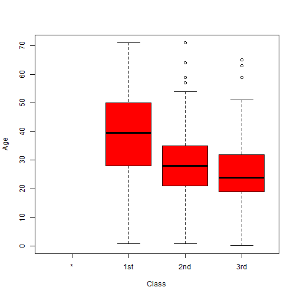
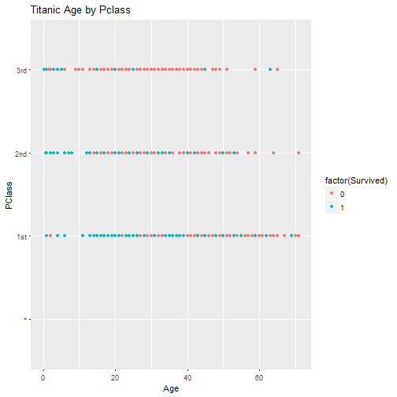
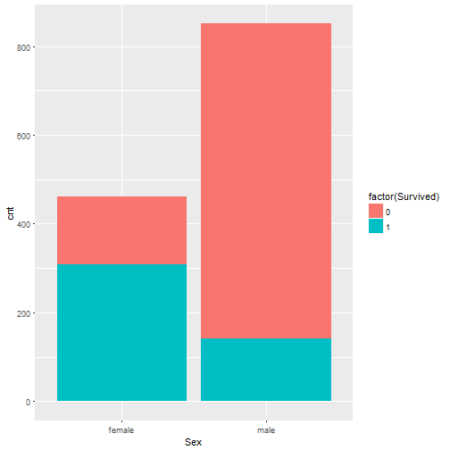
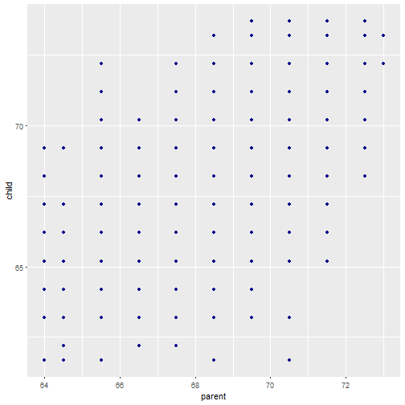
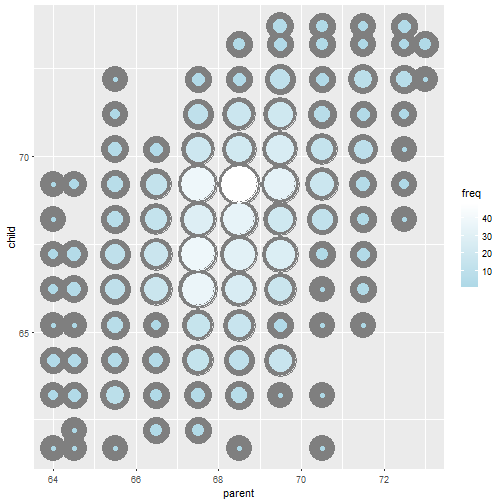
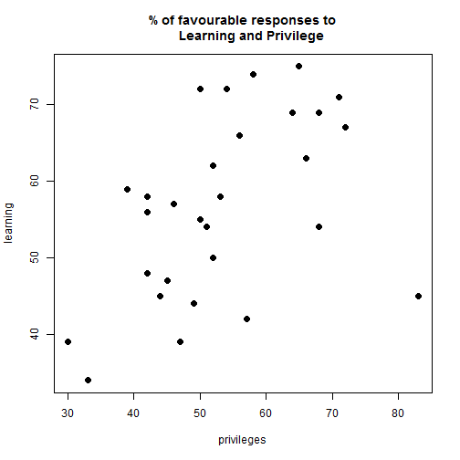
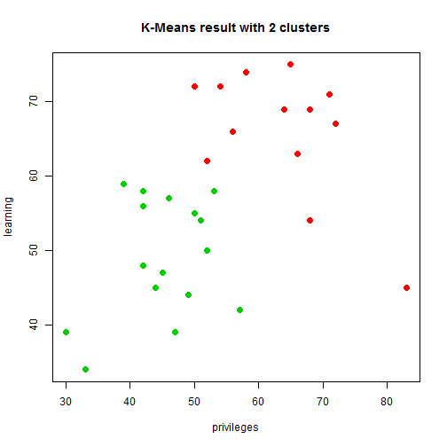

##  Data Related Terms  


--- class #id

## What a good data analysis come from?  

> - <q> A good data analysis come from a good __question__.</q>

--- .bigger   

## Data Analysis Basic Introduction  

> - Classical Method 
> - Exploratory Data Analysis 
> - Bayesian Analysis 

--- .class #id

## 有趣的事：Paul,the psychic octopus 

> - 章鱼保罗，曾经连续预测正确世界杯足球比赛结果8次。
> - 你认为章鱼保罗具有某种神奇的预测能力吗？

--- .class #id

## Case 1 : What's the problem?  

> - 1936年美国总统大选，著名期刊Literary Digest采访其100万读者，得到有43%的人选择罗斯福。   
> - 所以，判断罗斯福会输。 
> - 结果，罗斯福以62%的支持度赢得总统大学。因此该期刊在不久后停业。 

--- .class #id  

### Question1 ：为什么认为兰登会获得大选胜利？   
> - 点估计 ( point estimate )  
> - 正态分布( normal distribution )  
> - Z分数( Z score )  
> - P-value 和假设检验
> - 置信区间( confident interval )
> - 显著性水平(significent level)  

--- .class #id  

### Question2 : 预测结果和实际情况的偏离是由什么原因引起的？ 

--- .class #id

## Case 2 : 泰坦尼克号  
Question ：泰坦尼克号上获救的人是否完全随机呢？    
  
Titanic DataSet  

|  X|Name                                          |PClass |   Age|Sex    | Survived| SexCode|
|--:|:---------------------------------------------|:------|-----:|:------|--------:|-------:|
|  1|Allen, Miss Elisabeth Walton                  |1st    | 29.00|female |        1|       1|
|  2|Allison, Miss Helen Loraine                   |1st    |  2.00|female |        0|       1|
|  3|Allison, Mr Hudson Joshua Creighton           |1st    | 30.00|male   |        0|       0|
|  4|Allison, Mrs Hudson JC (Bessie Waldo Daniels) |1st    | 25.00|female |        0|       1|
|  5|Allison, Master Hudson Trevor                 |1st    |  0.92|male   |        1|       0|
|  6|Anderson, Mr Harry                            |1st    | 47.00|male   |        1|       0|

--- .class #id  

## 舱位等级与年龄的boxplot  


--- .class #id

### 获救的人和年龄或者舱位等级有关系吗？ 



--- .class #id  

### 获救的人和性别有关系吗？  


--- .class #id  

## T-test  
H0: There is no significant difference in the chances of survival of upper and lower class  
H1: There is a better chance of survival for upper class passengers  


```
## [1] 9.699754
```

--- .class #id  

## Chi-Square Test  

```
## 
## 	Pearson's Chi-squared test with Yates' continuity correction
## 
## data:  titan$Survived and titan$Sex
## X-squared = 329.84, df = 1, p-value < 2.2e-16
```

```
## Number of cases in table: 1313 
## Number of factors: 2 
## Test for independence of all factors:
## 	Chisq = 173.1, df = 3, p-value = 2.72e-37
## 	Chi-squared approximation may be incorrect
```

--- .class #id

### 回归问题(Regression Analysis)  
问题：如何通过父母的身高预测孩子的身高？  


--- .class #id  

### 原始的回归问题  


--- .class #id

### 聚类分析( Clustering Analysis ) 
调查一个大型金融组织的30个部门，每个部门35人。  
Chatterjee-Price Attitude Data   

| rating| complaints| privileges| learning| raises| critical| advance|
|------:|----------:|----------:|--------:|------:|--------:|-------:|
|     43|         51|         30|       39|     61|       92|      45|
|     63|         64|         51|       54|     63|       73|      47|
|     71|         70|         68|       69|     76|       86|      48|
|     61|         63|         45|       47|     54|       84|      35|
|     81|         78|         56|       66|     71|       83|      47|
|     43|         55|         49|       44|     54|       49|      34|

--- .class #id

## Kmeans algorithm  


--- .class #id

## The Result of Kmean   


--- .class #id

## Special Case 1 : Why Big Data?  
> - Chebyshev Inequality  
随机变量$X$的分布为 $P$，其均值为 $\mu$，那么
$$P(|X-\mu|\geq b) \leq \frac{Var(X)}{b^2}$$  
> - Insight, Efficiency, Cost Reduction

--- .class #id  

## Special Case 2 : Try to get something without data.  

> - If employee works with low effiency, who will responsible for?  

--- .class #id  

## End  
> - <q>  __Questions?__</q>

--- .bigger .center
