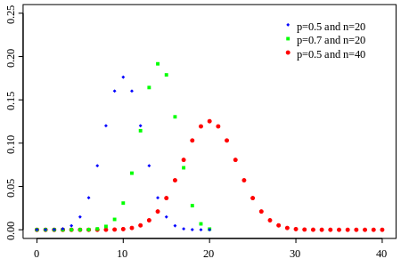
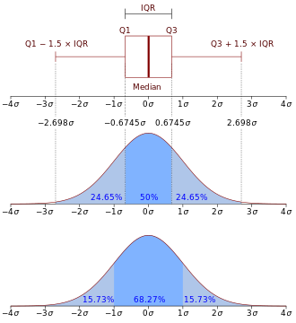
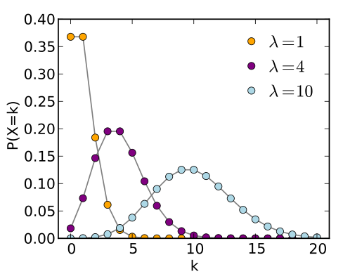

---
title       : "Data Analysis Foundation"
subtitle    : "Descriptive Statistics and Probability Bacis Theory"
author      : "Ma Ming"
job         : "Big Data Platform Architect and Data Scientist."
framework   : io2012  # {io2012, html5slides, shower, dzslides, ...}
highlighter : highlight.js  # {highlight.js, prettify, highlight}
hitheme     : tomorrow      # 
widgets     : mathjax            # {mathjax, quiz, bootstrap}
mode        : selfcontained # {standalone, draft}
url:
  assets: ../assets
  lib: ../libraries
logo        : logo.png
knit        : slidify::knit2slides

--- 

--- &twocol
## Course Introduction 
  
*** =left  
> - 概率论基础知识
    * 随机事件&随机变量
    * 独立事件&相关事件
    * 联合概率和条件概率
    * 加法法则和乘法法则
    * 全概率定理和贝叶斯公式
> - 总体和样本(Population and Sample)  
> - 描述性统计(Descriptive Statistics)  
> - 可视化(Visualization) 

*** =right  
> - 概率分布(Probability distribution)  
    * Normal Distribution
    * Binomial Distribution  
    * Possion Distribution  
> - 最大似然估计(MLE)

--- .class #id    
## Prelimitary  
> - Data Basics  
    * Observations,Variables and data matrics or data frame  
    * Type of Variables  
> - Random Variables  
> - Relationships between Variables  
> - PMF,PDF,CDF,SF

mtcars dataset  
```{r echo=FALSE,warning=FALSE,message=FALSE}
data(mtcars)
kable(head(mtcars,5), format = "markdown")
```  

--- .class
## Type of Variables  
> - Numerical (Quantitative)  
    * Continous  
    * Discrete  
> - Categorical (Qualitative)
    * Nominal  
    * Ordinal  
    
Airquality Dataset  
```{r echo=F}
library('knitr')
kable(head(airquality), format = "markdown")
```  

--- .class #id 
## 概率基础 
> - 随机事件是在随机试验中,可能出现也可能不出现,而在大量重复试验中具有某种规律性的事件叫做随机事件(简称事件)。
> - 随机事件所有可能的结果的集合称为样本空间。
> - 随机事件A或者B发生的概率:
$$P(A \cup B) = P(A)+P(B)-P(A \cap B)$$
> - 随机事件A和B同时发生的概率，即联合概率，记为$P(A,B)$或$P(AB)$
> - 给定随机事件B已发生的情况下，随机事件A发生的概率，为A以B为条件的概率，记为$P(A|B)$.
$$P(A|B)=\frac{P(AB)}{P(B)}$$
> - 全概率公式
$$P(A)=\sum_b P(AB)=\sum_b P(A|B=b)P(B=b)$$

--- .class
## 贝叶斯公式
$$P(A|D)=\frac{P(D|A)P(A)}{P(D)}$$
其中，
$P(A|D)$称为事件A的后验概率.  
$P(A)$称为先验概率。  
$P(D|A)$称为似然性。
> - 随机事件A,B相互独立，则满足  
$$P(AB)=P(A)P(B)$$

--- .class
## 例题1.
> - 根据以往的临床记录，某种癌症诊断事件的效果如下：如果病人患有癌症，则实验诊断为阳性的概率为95%。现在对自然人均进行筛查，已知自然人群中患癌症的概率为0.005, 问：该诊断试验结果为阳性的话，接受试验的人患有癌症的概率。
> - 解：设试验结果为阳性的概率为P(A),被诊断者患有癌症的概率为P(C)  
      已知$P(A|C) = 0.95，P(A|\bar{C})=0.05,P(C)=0.005,P(\bar{C})=0.995$  
      $$P(C|A) =\frac{P(A|C)P(C)}{P(A|C)P(C)+P(A|\bar{C})P(\bar{C})}=0.087$$ 

--- .class
## 例题2.
> - 标签问题  
  将15名新生平均分配到三个班级共有多少种分配方案?  
> - $$\binom{15}{5}\binom{10}{5}\binom{5}{5}=\frac{15!}{5!5!5!}$$

--- .class
## Random variables （随机变量）  

> - 一个 **random variable** 是一个实验或观察结果的数字形式输出.  
> - Random Variable有两种形式,  
  **discrete** or **continuous**.  
> - 离散型random variable ： 有限的可能性.    
  $P(X = k)$  
> - 连续型random variable接受一个实数范围.  
  $P(X \in A)$  

--- .class  

## 可以被考虑为是随机变量的例子    
> - 扔硬币的输出数字化$(0-1)$  
> - 扔骰子的输出  
> - 某天某网站的访问量    
> - 点击广告的人数    
> - Question? : How to describe the distribution of a random variable?   

--- .class #id
## Example 1 : Titanic dataset
```{r echo=FALSE,warning=FALSE,message=FALSE}
titan <- read.csv("../Titanic.csv",header=TRUE)
library('knitr')
kable(head(titan), format = "markdown")
```

--- .class #id

## Example 2 : iris dataset
```{r echo=FALSE,warning=FALSE,message=FALSE}
data(iris)
kable(head(iris), format = "markdown")
```

--- .class #id

## Example 3 : mtcars dataset
```{r echo=FALSE,warning=FALSE,message=FALSE}
data(mtcars)
kable(head(mtcars), format = "markdown")
```  

--- .class
## Relation between variables 
> - Correlation  
    * Explanatory Variable and Response Variable  
    * Positive and Negative  
    * Strong and Weak  
> -    

--- &twocol  
## Example  
  
  

> - Correlation DONOT imply Causation!!!  

--- .class
## Example again   

> - 某调查机构调查2379个9~19岁女生显示大部分吃早餐的女生都比较苗条，如果我们由此得出结论：  吃早餐可以使女士苗条。  
你认为正确吗？  
  
> - Correlation DONOT imply Causation!!!   

--- &twocol  
## PMF (Probability Mass Function)  
*** =left  

概率质量函数的值是随机变量取该值的概率:$p$   
  
  1. $p(x) \geq 0$ for all $x$
  2. $\sum_{x} p(x) = 1$

*** =right  

Example for PMF  

令 $X$ 代表抛硬币的结果，这里 $X=0$ 代表反面而 $X = 1$ 代表正面。  
$$
p(x) = (1/2)^{x} (1/2)^{1-x} ~~\mbox{ for }~~x = 0,1
$$
假如我们不知道硬币是否均匀; $\theta$ 表示正面出现的概率(在 0 和 1 之间).
$$
p(x) = \theta^{x} (1 - \theta)^{1-x} ~~\mbox{ for }~~x = 0,1
$$

--- &twocol  

## PDF (Probability Density Function)

*** =left
概率密度函数描述连续型随机变量的概率特征。  
  *pdf下的面积代表了该随机变量在相应范围出现的概率*

pdf = $f$ 必须满足  

1. $f(x) \geq 0$ for all $x$

2. The area under $f(x)$ is one.

*** =right  

Example of PDF

思考从求助热线打入的求救电话，其中得到解决的比例  
$$
f(x) = \left\{\begin{array}{ll}
    2 x & \mbox{ for } 1 > x > 0 \\
    0                 & \mbox{ otherwise} 
\end{array} \right. 
$$

这是一个有效的概率密度函数吗？  

--- .class  

## CDF and Survival function

- 一个随机变量的累积分布函数**cumulative distribution function** (CDF) $X$ 定义为   
$$
F(x) = P(X \leq x)
$$
- 适用于连续型和离散型随机变量  
- 留存函数**survival function** 定义为
$$
S(x) = P(X > x)
$$
- 注意 $S(x) = 1 - F(x)$
- 对连续型随机变量来说，PDF 是 CDF 的导数  

---  .class  

## Example

回想前面热线电话的例子，其CDF和SF:  

For $1 \geq x \geq 0$
$$
F(x) = P(X \leq x) = \frac{1}{2} Base \times Height = \frac{1}{2} (x) \times (2 x) = x^2
$$

$$
S(x) = 1 - x^2
$$

--- .class #id  

## Sampling & Sources of bias  
> - Population vs Sample  
> - Sources of Bias  
    * Convenience Sample   
    * No Response  
    * Voluntary Respone  
> - Sampling methods  
    * Simple random sampling (SRS)  
    * Stratified sample  
    * Cluster sample  
    * Multistage sample  

--- .class #id  

## Simple Random Sampling


--- .class #id  

## Stratified Sampling


--- .class #id

## Cluster Sampling


--- .class #id  

## Multistage Sampling


--- .class
## Descriptive Statistics  
> - Shape  
> - Center  
    * Mean  
    * Median   
    * Mode   
> - Spread 
    * Range 
    * Variance 
    * IQR (Inter Quarter Range)
> - Fivenum : $( Min,Q_1,Median,Q_3,Max)$
> - Visualization  

--- .class  
## Measure of Shape  
  

--- .class  
## Measure of Center  


--- .class  

## Measure of Spread  
> - Range : ( Max - Min )
> - Variance : $S^2 = \frac{\sum_{i=1} (X_i - \bar X)^2}{n-1}$
> - Standart Deviation : $\sqrt{Var(x)}$
> - IQR ( Inter Quartile Range) : $Q_3-Q_1$ 
> - Robust Statistics : Median，IQR  
 

--- .class 

## The population mean(总体均值)
- 随机变量**期望值 (expected value)** 或者 **均值** 被认为是随机变量的分布的中心点  
- 对于离散型随机变量 $X$ ，其 PMF 为 $p(x)$ 均值定义为  
    $$
    E[X] = \sum_x xp(x).
    $$
    这里的和是包括所有可能的 $x$
- 对于连续型随机变量 $X$, 其 PDF 为 $f(x)$ 均值定义为  
    $$
    E[X] = \int_{-\infty}^{\infty}xf(x)dx
    $$

--- .class  

## The sample mean(样本均值)
- 样本均值用来估算总体均值  
- 经验均值 (empirical mean)
$$
\bar X = \sum_{i=1}^n x_i p(x_i)
$$
where $p(x_i) = 1/n$

--- .class  

## The population variance(总体方差)

- 方差描述了一个随机变量的 *spread*(散布程度)  
- $X$ 是一个随机变量， 均值为 $\mu$, 其方差定义为：  

$$
Var(X) = E[(X - \mu)^2] = E[X^2] - E[X]^2
$$ 
标准差(The standart deviation)： $\sigma=\sqrt{Var}$  
- 到均值的期望距离
- 高方差意味着较大的散步程度或强波动性。
- 方差的平方根称为标准差 **standard deviation**
- 标准差与 $X$ 有同样的单位  
- Question: 为什么我们要对到均值距离平方来计算方差? 

--- .class  

## 样本方差(The sample variance) 
- The sample variance is 
$$
S^2 = \frac{\sum_{i=1} (X_i - \bar X)^2}{n-1}
$$
- 也是一个随机变量  
- 其平方根是样本标准差( sample standard deviation )  

--- &twocol
## Histogram (直方图)  
直方图是对数值型数据分布的一种图形化表示。 
*** =left  
```{r echo=F,warning=F,message=F}
a=rnorm(400 , mean=-5 , sd=12)
b=rnorm(400 , mean=20 , sd=3)
c=rnorm(200 , mean=-20 , sd=3)
df = data.frame(a,b,c)
kable(head(df,12), format = "markdown")
```

*** =right  
```{r echo=F,warning=F,message=F}
par(bg="grey90")
par(mar=c(0,0,0,0))
hist(a , col=rgb(1,0.2,0.2,0.7) , breaks=50 , xlim=c(-40 , 40) , main="" , ylim=c(-20 , 70) )
hist(b ,  col=rgb(0,1,0.5,1) , breaks=15 , add=T)
hist(c ,  col=rgb(0.6,0.4,1,1) , breaks=15 , add=T)
```

--- .class #id  

## Parameters of Histogram  
> - Number of bins : $k$
> - Or bin width : $h$  
> - How to choose $k$  
    * Square-root choice : $k=\sqrt{n}$
    * Sturges' formula : $k=\log_2 n + 1$  

--- &twocol  
## BarPlot (条形图)
> - 条形图是用矩形条来展现分组数据，矩形条的长度和分组数据的值是成比例的。
*** =left 
```{r echo=F,warning=F,message=F}
counts <- table(mtcars$gear)
```

mtcars counting for gear  

Gears#|3|4|5
---|---|---|---
counts|15|12|5

*** =right  
```{r echo=F,warning=F,message=F}
barplot(counts, main="Car Distribution",
   xlab="Number of Gears",col='lightblue') 
```


--- &twocol
## Stacked Barplot
*** =left  
```{r echo=F,warning=F,message=F}
counts <- table(mtcars$vs, mtcars$gear)
```

Gears#|3|4|5
---|---|---|---
vs=0|12|2|4
vs=1|3|10|1

*** =right
```{r echo=F,warning=F,message=F}
barplot(counts, main="Car Distribution by Gears and VS",
  xlab="Number of Gears", col=c("darkblue","red"),
  legend = rownames(counts)) 
```

--- &twocol
## DotPlot  
> - The dot plot as a representation of a distribution consists of group of data points plotted on a simple scale. Dot plots are used for continuous, quantitative, univariate data.  

*** =left  
> -  
(2,2,3,5,13,20,1,4,3,5,7,8,8,8,10,10,8,8,4,10,15,5,12,    12,14,14,16,16,17,19,19,4,6,9,7,12,13,11,11,17,18,18,  
18,18,18,18,18,12,12,12,12,12,12,12,12,12,12,12,  
12,20,20,20,20,20,20,1,1,1,20)  

*** =right
> -  
```{r echo=F,waring=F,message=F}
x<-c(2,2,3,5,13,20,1,4,3,5,7,8,8,8,10,10,8,8,4,10,15,5,12,    12,14,14,16,16,17,19,19,4,6,9,7,12,13,11,11,17,18,18,  
18,18,18,18,18,12,12,12,12,12,12,12,12,12,12,12,  
12,20,20,20,20,20,20,1,1,1,20)
stripchart(x,method="stack",
           at=c(0.05),
           pch=20,cex=2,
           las = 1,
           frame.plot = F,
           xlim=c(0,20))
```

--- &twocol

## Bubble Plot  
*** =left
The Crime Dataset  
```{r echo=F}
crime <- read.csv("http://datasets.flowingdata.com/crimeRatesByState2005.tsv", header=TRUE, sep="\t")
kable(head(crime),format = "markdown")
```

*** =right
> -  
```{r echo=F}
radius <- sqrt( crime$population/ pi )
symbols(crime$murder, crime$burglary, circles=radius, inches=0.35, fg="white", bg="red", xlab="Murder Rate", ylab="Burglary Rate")
text(crime$murder, crime$burglary, crime$state, cex=0.5)
```

--- .class 

## Rose Plot  
```{r echo=F,warning=F,message=F}
#d <- structure(list(Angle = c(0, 10, 20, 30, 40, 50, 60, 70, 80, 90, 
#100, 110, 120, 130, 140, 150, 160, 170, 180, 190, 200, 210, 220, 
#230, 240, 260, 270, 280, 290, 300, 310, 320, 330, 340, 350, 250
#), Frequency = c(0, 0, 0.001, 2, 4, 18.03, 11, 12, 5, 7, 10, 
#13, 2, 0.003, 0.01, 0, 1, 0.05, 2, 3, 3.7, 6, 0, 0, 0, 0, 0.2, 
#0.006, 0, 0, 0, 0, 0, 0, 0, 0)), .Names = c("Angle", "Frequency"
#), row.names = c(NA, 36L), class = "data.frame")
library(ggplot2)
library(RColorBrewer)
plot.windrose <- function(data,
                      spd,
                      dir,
                      spdres = 2,
                      dirres = 30,
                      spdmin = 2,
                      spdmax = 20,
                      spdseq = NULL,
                      palette = "YlGnBu",
                      countmax = NA,
                      debug = 0){


# Look to see what data was passed in to the function
  if (is.numeric(spd) & is.numeric(dir)){
    # assume that we've been given vectors of the speed and direction vectors
    data <- data.frame(spd = spd,
                       dir = dir)
    spd = "spd"
    dir = "dir"
  } else if (exists("data")){
    # Assume that we've been given a data frame, and the name of the speed 
    # and direction columns. This is the format we want for later use.    
  }  

  # Tidy up input data ----
  n.in <- NROW(data)
  dnu <- (is.na(data[[spd]]) | is.na(data[[dir]]))
  data[[spd]][dnu] <- NA
  data[[dir]][dnu] <- NA

  # figure out the wind speed bins ----
  if (missing(spdseq)){
    spdseq <- seq(spdmin,spdmax,spdres)
  } else {
    if (debug >0){
      cat("Using custom speed bins \n")
    }
  }
  # get some information about the number of bins, etc.
  n.spd.seq <- length(spdseq)
  n.colors.in.range <- n.spd.seq - 1

  # create the color map
  spd.colors <- colorRampPalette(brewer.pal(min(max(3,
                                                    n.colors.in.range),
                                                min(9,
                                                    n.colors.in.range)),                                               
                                            palette))(n.colors.in.range)

  if (max(data[[spd]],na.rm = TRUE) > spdmax){    
    spd.breaks <- c(spdseq,
                    max(data[[spd]],na.rm = TRUE))
    spd.labels <- c(paste(c(spdseq[1:n.spd.seq-1]),
                          '-',
                          c(spdseq[2:n.spd.seq])),
                    paste(spdmax,
                          "-",
                          max(data[[spd]],na.rm = TRUE)))
    spd.colors <- c(spd.colors, "grey50")
  } else{
    spd.breaks <- spdseq
    spd.labels <- paste(c(spdseq[1:n.spd.seq-1]),
                        '-',
                        c(spdseq[2:n.spd.seq]))    
  }
  data$spd.binned <- cut(x = data[[spd]],
                         breaks = spd.breaks,
                         labels = spd.labels,
                         ordered_result = TRUE)
  # clean up the data
  data. <- na.omit(data)

  # figure out the wind direction bins
  dir.breaks <- c(-dirres/2,
                  seq(dirres/2, 360-dirres/2, by = dirres),
                  360+dirres/2)  
  dir.labels <- c(paste(360-dirres/2,"-",dirres/2),
                  paste(seq(dirres/2, 360-3*dirres/2, by = dirres),
                        "-",
                        seq(3*dirres/2, 360-dirres/2, by = dirres)),
                  paste(360-dirres/2,"-",dirres/2))
  # assign each wind direction to a bin
  dir.binned <- cut(data[[dir]],
                    breaks = dir.breaks,
                    ordered_result = TRUE)
  levels(dir.binned) <- dir.labels
  data$dir.binned <- dir.binned

  # Run debug if required ----
  if (debug>0){    
    cat(dir.breaks,"\n")
    cat(dir.labels,"\n")
    cat(levels(dir.binned),"\n")       
  }  

  # deal with change in ordering introduced somewhere around version 2.2
  if(packageVersion("ggplot2") > "2.2"){    
    cat("Hadley broke my code\n")
    data$spd.binned = with(data, factor(spd.binned, levels = rev(levels(spd.binned))))
    spd.colors = rev(spd.colors)
  }

  # create the plot ----
  p.windrose <- ggplot(data = data,
                       aes(x = dir.binned,
                           fill = spd.binned)) +
    geom_bar() + 
    scale_x_discrete(drop = FALSE,
                     labels = waiver()) +
    coord_polar(start = -((dirres/2)/360) * 2*pi) +
    scale_fill_manual(name = "Wind Speed (m/s)", 
                      values = spd.colors,
                      drop = FALSE) +
    theme(axis.title.x = element_blank())

  # adjust axes if required
  if (!is.na(countmax)){
    p.windrose <- p.windrose +
      ylim(c(0,countmax))
  }

  # print the plot
  print(p.windrose)  

  # return the handle to the wind rose
  return(p.windrose)
}
data <- read.csv(file = "./20130101.csv",
                    col.names = c("date","hr","ws.80","wd.80"),
                    stringsAsFactors = FALSE)
p1 <- plot.windrose(spd = data$ws.80,
                   dir = data$wd.80,
                   spdseq = c(0,3,6,12,20))
#ggplot(d, aes(x = Angle, y = Frequency)) +
#  coord_polar(theta = "x", start = -pi/36) +
#  geom_bar(stat = "identity") +
#  scale_x_continuous(breaks = seq(0, 360, 60))
```

--- .class
## Mosaic Plot  
Mosaic plot常常用来展示多个Categorical data(分类数据)  
```{r echo=F,warning=F,message=F,fig.width=10}
library(vcd)
data(HairEyeColor)
#kable(head(HairEyeColor),format = "markdown")
mosaic(HairEyeColor, shade=TRUE, legend=TRUE) 
```

--- .class
## The Bernoulli distribution

- **伯努利分布(Bernoulli distribution)** 是一个两值输出。 
- 伯努利随机变量只输出1或者0，对应概率为 $p$ and $1-p$ 。
- 伯努利随机变量 $X$ ,其PMF $$P(X = x) =  p^x (1 - p)^{1 - x}$$
- 伯努利随机变量均值为 $p$ ，方差为 $p(1 - p)$
- 我们一般把 $X=1$ 认为是 "success" ，而 $X=0$ 认为是 "failure"  
- 记为 $X \sim Ber(p)$

--- &twocol

## 二项式分布(Binomial distribution
*** =left

- *二项随机变量(binomial random variables)* 是由独立不相关(iid)的伯努利变量的和得到的。 
- 令 $X_1,\ldots,X_n$ 为 $iid\ Bernoulli(p)$; 那么 $X = \sum_{i=1}^n X_i$ 是二项随机变量。 
- The binomial mass function is
$$
P(X = x) = 
\left(
\begin{array}{c}
  n \\ x
\end{array}
\right)
p^x(1 - p)^{n-x}
$$
对于 $x=0,\ldots,n$ 
- 记为 $X\sim Bin(n,p)$
- $\mu=p,\sigma^2=p(1-p)$
- 考虑扔十次硬币，出现正面的次数  

*** =right
> -  


---  .class  

## 正态分布(The normal distribution)

- 一个 **正态(normal)** 或者 **高斯(Gaussian)** 分布随机变量均值为 $\mu$ ,方差为 $\sigma^2$ ，其 概率密度函数:
  $$
  f(x)=(2\pi \sigma^2)^{-1/2}e^{-(x - \mu)^2/2\sigma^2}
  $$
  如果 $X$ 是符合此密度函数的随机变量，那么 $E[X] = \mu$ 且 $Var(X) = \sigma^2$  
- 记为 $X\sim \mbox{N}(\mu, \sigma^2)$
- 当 $\mu = 0$ 且$\sigma = 1$ ，称为 **标准正态分布(the standard normal distribution)**
- 标准正态分布经常用 $Z$ 来表示 
- 设 $X \sim Z$, 若 $Z_\alpha$ 满足条件 $P\{X>z_\alpha \} = \alpha$
   则称 $z_\alpha$ 为标准正态分布上的 $\alpha$ 分位点   
   $z_{0.05} = 1.645,\ z_{0.025} = 1.96,\ z_{0.005}=2.57,\ z_{0.001}=3.10$

---  &twocol  
## Normal Distribution 特性
在自然现象和社会现象中，大量随机变量都符合正态分布或近似正态分布。  
*** =left
> -  
```{r echo=FALSE,warning=FALSE,message=FALSE}
set.seed(4566)
data <- rnorm(1000)
# layout where the boxplot is at top 
nf <- layout(mat = matrix(c(1,2),2,1, byrow=TRUE),  height = c(1,3))
par(mar=c(3.1, 3.1, 1.1, 2.1))
boxplot(data, horizontal=TRUE,  outline=TRUE,ylim=c(-4,4), frame=F, col = "green1")
hist(data,xlim=c(-4,4), col = "steelblue")
```

*** =right  
> -   

--- .class #id 

## Example for Norm and ScatterPlot  
  
```{r echo=FALSE,warning=FALSE,message=FALSE}
 library(ggplot2)
library(gridExtra)
 x<-rnorm(300)
 y<-rt(300,df=2)
 hist_top <- ggplot()+geom_histogram(aes(rnorm(300)),fill="blue")
empty <- ggplot()+geom_point(aes(1,1), colour="white")+
         theme(axis.ticks=element_blank(), 
               panel.background=element_blank(), 
               axis.text.x=element_blank(), axis.text.y=element_blank(),           
               axis.title.x=element_blank(), axis.title.y=element_blank())

scatter <- ggplot()+geom_point(aes(rnorm(300), rnorm(300)))
hist_right <- ggplot()+geom_histogram(aes(rnorm(300)),fill="steelblue")+coord_flip()
grid.arrange(hist_top, empty, scatter, hist_right, ncol=2, nrow=2, widths=c(4, 1), heights=c(1, 4))
```  

[](https://gallery.shinyapps.io/dist_calc/)

--- &twocol  
## 泊松分布(The Poisson distribution)  
*** =left  

* 用来对次数进行建模  
* Poisson PMF  
$$
P(X = x; \lambda) = \frac{\lambda^x e^{-\lambda}}{x!}
$$
对于 $x=0,1,\ldots$
* 均值 $\lambda$
* 方差也为 $\lambda$
* 注意这里 $x$ 取值范围是从 $0$ 到 $\infty$  
* 记为 $X\sim \pi(\lambda)$  

*** =right  


--- .class  

## Example Poisson distribution
* Modeling count data  
* Modeling event-time or survival data
* Modeling contingency tables
* Approximating binomials when $n$ is large and $p$ is small

--- .class
## Rates and Poisson random variables
* 泊松随机变量经常对单位时间或面积某事件发生的次数建模
* $X \sim Poisson(\lambda t)$ ,这里 
  * $\lambda = E[X / t]$ 是单位时间内的期望计数。  
  * $t$ 是观察时间  
  
  
当 $n$ 很大同时 $p$ 很小时，泊松分布是二项式分布的一个精确近似。  
* Notation
  * $X \sim \mbox{Binomial}(n, p)$
  * $\lambda = n p$
  * $n$ gets large while $p$ gets small

--- &twocol 
## 泊松分布的例子  
*** =left  

> 1. 在一个时间间隔内某电话交换台收到的电话呼叫次数。  
> 2. 一本书一页中的印刷错误数。  
> 3. 某地区一天内邮递丢失的信件数。  
> 4. 某医院一天内的急诊病人数。  
> 5. 某城市一个时间间隔内发生交通事故的次数。  

*** =right  

> - Question 1 : 在一公共汽车站出现的人数符合Poission分布，均值为$2.5$ 每小时.  
    如果我们观察这个车站4小时, 整个时间内小于等于3个人出现的概率是多少?   
    
    
    
> - Question 2 : 设一本书的各页的印刷错误个数X服从泊松分布,已知有一个和两个印刷错误的页数相同,试求随意抽查的4页中无印刷错误的概率.

--- .class #id
## 泊松分布的练习答案  
> - 解 1 ：公共汽车站平均每小时出现2.5人，也就是说平均4小时出现8人，并符合泊松分布 $Poisson(\lambda=8)$ ，小于等于3个人的概率  
    $P = \frac{\lambda^0*e^{-\lambda}}{0!}+\frac{\lambda^1*e^{-\lambda}}{1!}+\frac{\lambda^2*e^{-\lambda}}{2!}+\frac{\lambda^3*e^{-\lambda}}{3!}$
    将 $\lambda=8$带入即可得到答案。  
> - 解 2 ： 我们首先需要求出 $\lambda$  
    由题意可知  
    $\frac{\lambda^1*e^{-\lambda}}{1!}=\frac{\lambda^2*e^{-\lambda}}{2!}$ 解得 $\lambda=2$  
    说明各页印刷错误次数X服从 $Poisson(\lambda=2)$ 
    随机取一页没有错误的概率为 $\frac{\lambda^0*e^{-\lambda}}{0!}=e^{-2}$  
    那么随机抽四页没有错误的概率为 ${(e^{-2})}^{-4}=e^{-8}$
    

--- &twocol
## Option 1 : 峰度 (Kurtosis) 和 偏度 (Skewness)


*** =left
偏度 是统计数据分布偏斜方向和程度的度量，< 0 称分布具有负偏离，也称左偏态。>0称分布具有正偏离，也称右偏态。
数学上是随机变量标准化后的三阶统计量。
$$
v_1 = E[(\frac{x-E(x)}{\sqrt{Var(x)}})^3]
$$

*** =right
峰度 表征概率密度分布曲线在平均值处峰值高低的特征数。直观看来，峰度反映了峰部的尖度。峰度越大越说明尾部越窄小，反之尾部比较肥大。 
数学上是随机变量标准化后的四阶统计量。 
$$
V_2 = E[(\frac{x-E(x)}{\sqrt{Var(x)}})^4]
$$


--- .class

## Option 2
> - 问题1：将$n$只球随机的放入$N(N\geqq n)$个盒子中，试求每个盒子至多有一个球的概率（设盒子的容量不限）。
> - $$ p=\frac{N(N-1)(N-2)...(N-n+1)}{N^n} $$
> - 求解生日悖论
> - 问题2：设有$N$间产品，其中有$D$件次品，从中任取$n$件，
           问其中有 $k(k\leqq D)$ 件次品的概率是多少？
> - $$ p=\frac{\binom{D}{K}\binom{N-D}{n-k}}{\binom{N}{n}}$$
> - 超几何分布  


--- .class

## Option 3
马尔可夫不等式(Markov Inequality)  
随机变量$X>0$，任意实数$a>0$，有  
$$P(X\geqq a) \leqq \frac{E(x)}{a}$$
证： 设$X$的概率密度函数为$f(x)$   
$$P(X\geqq a) \leqq \int_{a}^{\infty}\frac{X}{a}f(x)dx \leqq E(X/a)$$

--- .class

## Option 4
切比雪夫不等式(Chebyshev Inequality)  
随机变量 $X$ 的均值为 $\mu$，方差为 $\sigma^2$ ，有  
$$P(|X-\mu|\geqq \epsilon) \leqq \frac{\sigma^2}{\epsilon^2}$$
证：
  将$|X-\mu|$带入马尔可夫不等式，可得:  
  $$
    p(|X-\mu|\geqq a) \leqq \frac{E(|X-\mu|)}{a}  
  $$
  $$
    P((X-\mu)^2\geqq a^2)\leqq \frac{E((X-\mu)^2)}{a^2}=\frac{\sigma^2}{a^2}
  $$
  


--- .class

## Option 5
霍夫丁不等式(Hoeffding Inequality)  
考虑伯努利随机变量 $X$ ，其正面发生的概率为 $p$ ，对于 $\epsilon>0$ ，试验 $n$ 次，其正面出现的次数记为 $H(n)$ ，有  
$$P((p-\epsilon)n\leqq H(n)\leqq (p+\epsilon)n) \geqq 1-2exp(-2\epsilon^2n)$$


--- .class
## Option 6
最大似然估计(Maximum Likelihood Estimation)  
> - 若总体 $X$ 是连续性，其概率密度为 $f(x;\theta),\theta \in \Theta$ 的形式已知，$\theta$ 为待估参数，$\Theta$ 是 $\theta$的可取范围。设 $X_1,X_2,...,X_n$ 是来自 $X$ 的样本，则 $X_1,X_2,...,X_n$ 的联合概率密度为  
  $$\prod_{i=1}^{n}f(x_i,\theta)$$
又设 $x_1,x_2,...,x_n$ 是相应于样本 $X_1,X_2,...,X_n$ 的观测值，样本的似然函数定义为：  
  $$L(\theta) = L(x_1,x_2,...,x_n;\theta)=\prod_{i=1}^{n}f(x_i,\theta)$$
而使似然函数最大的 $\theta$ 的估计值  
  $$\hat{\theta}=argmax_{\theta \in \Theta} L(\theta;x)$$
称为 $\theta$的最大似然估计。


--- .class
## ...接上页
> - 为了计算方便，实践中我们常采用似然函数的对数形式，并对其求导而得到 $\hat{\theta}$  
> - 例题： 设 $X\sim B(1,p), X_1,X_2,...X_n$ 是来自 $X$ 的一个样本值，求参数 $p$ 的极大似然估计。  
解： 设 $x_1,x_2,...,x_n$ 是相应于样本  $X_1,X_2,...X_n$ 的样本值，$X$的分布律为  
  $$P\{X=x\}=p^x(1-p)^{1-x},x=0,1.$$
似然函数为  
  $$L(p)=\prod_{i=1}^{n}p^{x_i}(1-p)^{1-x_i},$$
而 $lnL(p)=(\sum_{i=1}^{n}x_i)ln(p)+(n-\sum_{i=1}^{n}x_i)ln(1-p)$  
令$$\frac{dlnL(p)}{dp}=\frac{\sum_{i=1}^{n}x_i}{p}-\frac{n-\sum_{i=1}^{n}x_i}{1-p}=0,$$
解得 $\hat{p}=\frac{1}{n}\sum_{i=1}^{n}x_i=\bar{x}$


