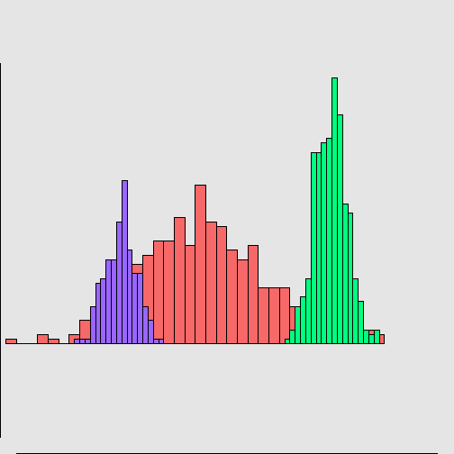
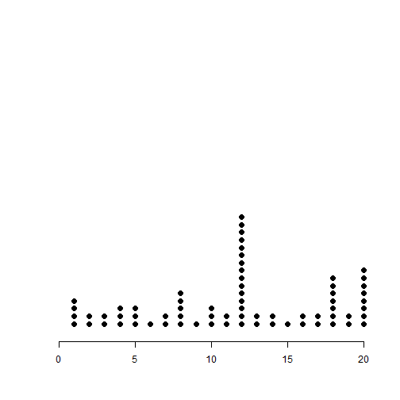
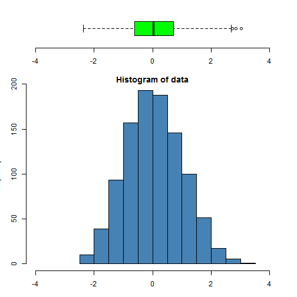

## Course Introduction 
> - Prelimitary 
> - Population and Sample  
> - Random Variable  
> - Descriptive Statistics  
> - Visualization 
> - Probability distribution  
    * Normal Distribution
    * Binomial Distribution  
    * Possion Distribution  

--- .class #id   

## Prelimitary  
> - Data Basics  
    * Observations,Variables and data matrics or data frame  
    * Type of Variables  
> - Random Variables  
> - Relationships between Variables  
> - PMF PDF CDF SF  

--- .class

## Type of Variables  
> - Numerical (Quantitative)  
    * Continous  
    * Discrete  
> - Categorical (Qualitative)
    * Nominal  
    * Ordinal  

--- .class #id  

## Random variables （随机变量）  

> - 一个 **random variable** 是一个实验或观察结果的数字形式输出.  
> - Random Variable有两种形式,  
  **discrete** or **continuous**.  
> - 离散型random variable ： 有限的可能性.    
  $P(X = k)$  
> - 连续型random variable接受一个实数范围.  
  $P(X \in A)$  

--- .class  

## Examples of variables that can be thought of as random variables  
- The $(0-1)$ outcome of the flip of a coin
- The outcome from the roll of a die
- The web site traffic on a given day  
- The number of people who click on an Ad  
- Question? : How to describe the distribution of a random variable?   

--- .class

## Relation between variables 
> - Correlation  
    * Positive and Negativa  
    * Strong and Weak  
> -    

--- .class

## Example for correlation vs causation   
> - 某调查机构调查2379个9~19岁女生显示大部分吃早餐的女生都比较苗条，如果我们由此得出结论：  
吃早餐可以使女士苗条  
你认为正确吗？ 
> - Correlation DONOT imply Causation!!!   

--- .class

## PMF (Probability Mass Function)   
  
A probability mass function evaluated at a value corresponds to the
probability that a random variable takes that value. To be a valid
pmf, $p$, must satisfy  
  
  1. $p(x) \geq 0$ for all $x$
  2. $\sum_{x} p(x) = 1$

The sum is taken over all of the possible values for $x$.

--- .class #id

## Example for PMF  

Let $X$ be the result of a coin flip where $X=0$ represents
tails and $X = 1$ represents heads.
$$
p(x) = (1/2)^{x} (1/2)^{1-x} ~~\mbox{ for }~~x = 0,1
$$
Suppose that we do not know whether or not the coin is fair; Let
$\theta$ be the probability of a head expressed as a proportion
(between 0 and 1).
$$
p(x) = \theta^{x} (1 - \theta)^{1-x} ~~\mbox{ for }~~x = 0,1
$$

--- .class

## PDF (Probability Density Function)

A probability density function (pdf), is a function associated with
a continuous random variable 

  *Areas under pdfs correspond to probabilities for that random variable*

To be a valid pdf, a function $f$ must satisfy

1. $f(x) \geq 0$ for all $x$

2. The area under $f(x)$ is one.

--- .class  

## Example of PDF

Suppose that the proportion of help calls that get addressed in
a random day by a help line is given by
$$
f(x) = \left\{\begin{array}{ll}
    2 x & \mbox{ for } 1 > x > 0 \\
    0                 & \mbox{ otherwise} 
\end{array} \right. 
$$

Is this a mathematically valid density?

--- .class  

## CDF and survival function

- The **cumulative distribution function** (CDF) of a random variable $X$ is defined as the function 
$$
F(x) = P(X \leq x)
$$
- This definition applies regardless of whether $X$ is discrete or continuous.
- The **survival function** of a random variable $X$ is defined as
$$
S(x) = P(X > x)
$$
- Notice that $S(x) = 1 - F(x)$
- For continuous random variables, the PDF is the derivative of the CDF

---  .class  

## Example

What are the survival function and CDF from the density considered before?

For $1 \geq x \geq 0$
$$
F(x) = P(X \leq x) = \frac{1}{2} Base \times Height = \frac{1}{2} (x) \times (2 x) = x^2
$$

$$
S(x) = 1 - x^2
$$


```r
pbeta(c(0.4, 0.5, 0.6), 2, 1)
```

```
## [1] 0.16 0.25 0.36
```

--- .class #id  

## Sampling & Sources of bias  
> - Census vs Sample  
> - Sources of Bias  
    * Convenience Sample   
    * No Response  
    * Voluntary Respone  
> - Sampling methods  
    * Simple random sampling (SRS)  
    * Stratified sample  
    * Cluster sample  
    * Multistage sample  

--- .class #id  

## Sampling Methods
* simple random sampling (SRS)  
* stratified sample  
* cluster sample  
* multistage sample  

--- .class #id  

## Simple Random Sampling


--- .class #id  

## Stratified Sampling


--- .class #id

## Cluster Sampling


--- .class #id  

## Multistage Sampling


--- .class
## Descriptive Statistics  
> - Center  
    * Mean  
    * Median   
    * Mode   
> - Shape  
> - Spread 
    * Range 
    * Variance 
    * IQR (Inter Quarter Range)
> - Fivenum : $( Min,Q_1,Median,Q_3,Max)$
> - Visualization  

--- .class  
## Measure of Shape  
  

--- .class  
## Measure of Center  


--- .class  

## Measure of Spread  
> - Range : ( Max - Min )
> - Variance : $S^2 = \frac{\sum_{i=1} (X_i - \bar X)^2}{n-1}$
> - Standart Deviation : $\sqrt{Var(x)}$
> - IQR ( Inter Quartile Range) : $Q_3-Q_1$ 
> - Robust Statistics : Mean,IQR  
> - Question: For Variance, Why do we square the difference?  

--- .class 

## The population mean
- The **expected value** or **mean** of a random variable is the center of its distribution
- For discrete random variable $X$ with PMF $p(x)$, it is defined as follows
    $$
    E[X] = \sum_x xp(x).
    $$
    where the sum is taken over the possible values of $x$
- $E[X]$ represents the center of mass of a collection of locations and weights, $\{x, p(x)\}$  

--- .class  

## The sample mean
- The sample mean estimates this population mean
- The center of mass of the data is the empirical mean
$$
\bar X = \sum_{i=1}^n x_i p(x_i)
$$
where $p(x_i) = 1/n$

--- .class  

## The variance

- The variance of a random variable is a measure of *spread*
- If $X$ is a random variable with mean $\mu$, the variance of $X$ is defined as

$$
Var(X) = E[(X - \mu)^2] = E[X^2] - E[X]^2
$$ 

- The expected (squared) distance from the mean
- Densities with a higher variance are more spread out than densities with a lower variance
- The square root of the variance is called the **standard deviation**
- The standard deviation has the same units as $X$

--- .class  

## The sample variance 
- The sample variance is 
$$
S^2 = \frac{\sum_{i=1} (X_i - \bar X)^2}{n-1}
$$
(almost, but not quite, the average squared deviation from
the sample mean)
- It is also a random variable
  - It has an associate population distribution
  - Its expected value is the population variance
  - Its distribution gets more concentrated around the population variance with more data
- Its square root is the sample standard deviation


--- .class #id  
## Histogram (直方图)  
A histogram is a graphical representation of the distribution of numerical data.    


--- .class #id  

## Parameters of Histogram  
> - Number of bins : $k$
> - Or bin width : $h$  
> - How to choose $k$  
    * Square-root choice : $k=\sqrt{n}$
    * Sturges' formula : $k=\log_2 n + 1$  

--- .class  

## BarPlot (条形图)
> - A bar chart or bar graph is a chart or graph that presents grouped data with rectangular bars with lengths proportional to the values that they represent.  


--- .class #id

## DotPlot  
> - The dot plot as a representation of a distribution consists of group of data points plotted on a simple scale. Dot plots are used for continuous, quantitative, univariate data.  



--- &radio

## Question 1

what is 1 + 1?


1. 1 
2. _2_
3. 3


*** .hint

This is a hint

*** .explanation

This is an explanation

--- .bigger

## Interactive Chart

--- .class #id

## Bubble Plot  


--- .class 

## The Bernoulli distribution

- The **Bernoulli distribution** arises as the result of a binary outcome
- Bernoulli random variables take (only) the values 1 and 0 with probabilities of (say) $p$ and $1-p$ respectively
- The PMF for a Bernoulli random variable $X$ is $$P(X = x) =  p^x (1 - p)^{1 - x}$$
- The mean of a Bernoulli random variable is $p$ and the variance is $p(1 - p)$
- If we let $X$ be a Bernoulli random variable, it is typical to call $X=1$ as a "success" and $X=0$ as a "failure"

---

## Binomial trials

- The *binomial random variables* are obtained as the sum of iid Bernoulli trials
- In specific, let $X_1,\ldots,X_n$ be iid Bernoulli$(p)$; then $X = \sum_{i=1}^n X_i$ is a binomial random variable
- The binomial mass function is
$$
P(X = x) = 
\left(
\begin{array}{c}
  n \\ x
\end{array}
\right)
p^x(1 - p)^{n-x}
$$
for $x=0,\ldots,n$

---  .class  

## The normal distribution

- A random variable is said to follow a **normal** or **Gaussian** distribution with mean $\mu$ and variance $\sigma^2$ if the associated density is
  $$
  (2\pi \sigma^2)^{-1/2}e^{-(x - \mu)^2/2\sigma^2}
  $$
  If $X$ a RV with this density then $E[X] = \mu$ and $Var(X) = \sigma^2$
- We write $X\sim \mbox{N}(\mu, \sigma^2)$
- When $\mu = 0$ and $\sigma = 1$ the resulting distribution is called **the standard normal distribution**
- Standard normal RVs are often labeled $Z$

---  .class  

## Normal Distribution  


--- .class #id 

## 


--- .class  
## The Poisson distribution
* Used to model counts
* The Poisson mass function is
$$
P(X = x; \lambda) = \frac{\lambda^x e^{-\lambda}}{x!}
$$
for $x=0,1,\ldots$
* The mean of this distribution is $\lambda$
* The variance of this distribution is $\lambda$
* Notice that $x$ ranges from $0$ to $\infty$

--- .class  

## Some uses for the Poisson distribution
* Modeling count data  
* Modeling event-time or survival data
* Modeling contingency tables
* Approximating binomials when $n$ is large and $p$ is small

---
## Rates and Poisson random variables
* Poisson random variables are used to model rates
* $X \sim Poisson(\lambda t)$ where 
  * $\lambda = E[X / t]$ is the expected count per unit of time
  * $t$ is the total monitoring time

---
## Example
The number of people that show up at a bus stop is Poisson with
a mean of $2.5$ per hour.

If watching the bus stop for 4 hours, what is the probability that $3$
or fewer people show up for the whole time?


## Normal Distribution  


--- .class #id 

## 


