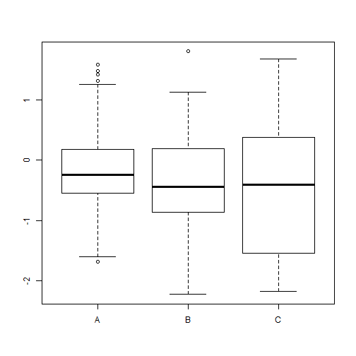

## Course Introduction 
> - Prelimitary 
> - Population and Sample  
> - Random Variable  
> - Probability distribution  
> - Parameter Estimate  
> - Hypothesis Test  
> - Statistical Analysis  

--- .class #id

## What a good data analysis come from?  

> - <q> A good data analysis come from a good __question__.</q>

--- .bigger  

## Basic Introduction on Data Analysis 

> - Classical Method 
> - Exploratory Data Analysis 
> - Bayesian Analysis 

--- .class #id

## Prelimitary Knowledge  
> - Data Basics  
    - Observations,Variables and data matrics or data frame 
    - Type of Variables  
    - Relationships between Variables 
> - Visualization 
    - Scatter plot
    - Histogram 
    - Dotplot  
    - Boxplot

--- .class #id  

## Example 1 : Titanic dataset

|  X|Name                                          |PClass |   Age|Sex    | Survived| SexCode|
|--:|:---------------------------------------------|:------|-----:|:------|--------:|-------:|
|  1|Allen, Miss Elisabeth Walton                  |1st    | 29.00|female |        1|       1|
|  2|Allison, Miss Helen Loraine                   |1st    |  2.00|female |        0|       1|
|  3|Allison, Mr Hudson Joshua Creighton           |1st    | 30.00|male   |        0|       0|
|  4|Allison, Mrs Hudson JC (Bessie Waldo Daniels) |1st    | 25.00|female |        0|       1|
|  5|Allison, Master Hudson Trevor                 |1st    |  0.92|male   |        1|       0|
|  6|Anderson, Mr Harry                            |1st    | 47.00|male   |        1|       0|

--- .class #id

## Example 2 : iris dataset

| Sepal.Length| Sepal.Width| Petal.Length| Petal.Width|Species |
|------------:|-----------:|------------:|-----------:|:-------|
|          5.1|         3.5|          1.4|         0.2|setosa  |
|          4.9|         3.0|          1.4|         0.2|setosa  |
|          4.7|         3.2|          1.3|         0.2|setosa  |
|          4.6|         3.1|          1.5|         0.2|setosa  |
|          5.0|         3.6|          1.4|         0.2|setosa  |
|          5.4|         3.9|          1.7|         0.4|setosa  |

--- .class #id

## Example 3 : mtcars dataset

|                  |  mpg| cyl| disp|  hp| drat|    wt|  qsec| vs| am| gear| carb|
|:-----------------|----:|---:|----:|---:|----:|-----:|-----:|--:|--:|----:|----:|
|Mazda RX4         | 21.0|   6|  160| 110| 3.90| 2.620| 16.46|  0|  1|    4|    4|
|Mazda RX4 Wag     | 21.0|   6|  160| 110| 3.90| 2.875| 17.02|  0|  1|    4|    4|
|Datsun 710        | 22.8|   4|  108|  93| 3.85| 2.320| 18.61|  1|  1|    4|    1|
|Hornet 4 Drive    | 21.4|   6|  258| 110| 3.08| 3.215| 19.44|  1|  0|    3|    1|
|Hornet Sportabout | 18.7|   8|  360| 175| 3.15| 3.440| 17.02|  0|  0|    3|    2|
|Valiant           | 18.1|   6|  225| 105| 2.76| 3.460| 20.22|  1|  0|    3|    1|

--- .class #id

## Case 1 : What's the problem?  

--- .class #id 

## Mean and Variance  
> 1. Shape 
> 2. Measure of Center  
    - Mean
    - Median 
    - Mode 
> 3. Measure of Spread  
    - Range 
    - Variance 
    - IQR (Inter Quarter Range)

--- .class #id  

## Shape 

--- .class #id  

## The population mean
- The **expected value** or **mean** of a random variable is the center of its distribution
- For discrete random variable $X$ with PMF $p(x)$, it is defined as follows
    $$
    E[X] = \sum_x xp(x).
    $$
    where the sum is taken over the possible values of $x$
- $E[X]$ represents the center of mass of a collection of locations and weights, $\{x, p(x)\}$  

--- 

## The sample mean
- The sample mean estimates this population mean
- The center of mass of the data is the empirical mean
$$
\bar X = \sum_{i=1}^n x_i p(x_i)
$$
where $p(x_i) = 1/n$

--- 

## The variance

- The variance of a random variable is a measure of *spread*
- If $X$ is a random variable with mean $\mu$, the variance of $X$ is defined as

$$
Var(X) = E[(X - \mu)^2] = E[X^2] - E[X]^2
$$ 

- The expected (squared) distance from the mean
- Densities with a higher variance are more spread out than densities with a lower variance
- The square root of the variance is called the **standard deviation**
- The standard deviation has the same units as $X$

---

## The sample variance 
- The sample variance is 
$$
S^2 = \frac{\sum_{i=1} (X_i - \bar X)^2}{n-1}
$$
(almost, but not quite, the average squared deviation from
the sample mean)
- It is also a random variable
  - It has an associate population distribution
  - Its expected value is the population variance
  - Its distribution gets more concentrated around the population variance with more data
- Its square root is the sample standard deviation

---
## What we learn from case 1  
> 1. Population and Sample  
> 2. T-test  
> 3. Confidence Interval 

--- .class #id 
  
## Sampling Methods
* simple random sampling (SRS)  
* stratified sample  
* cluster sample  
* multistage sample  

--- .class #id  

## Simple Random Sampling

--- .class #id  

## Stratified Sampling

--- .class #id

## Cluster Sampling

--- .class #id  

## Multistage Sampling

--- .class #id  

## Normal Distribution  

--- .class #id 

## 

## Case 2 : Try to get something without data.  

> - If employee works with low effiency, who will responsible for?  

--- .class #id

