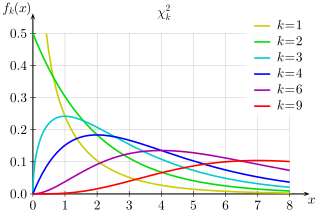
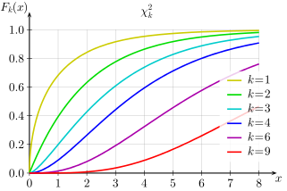
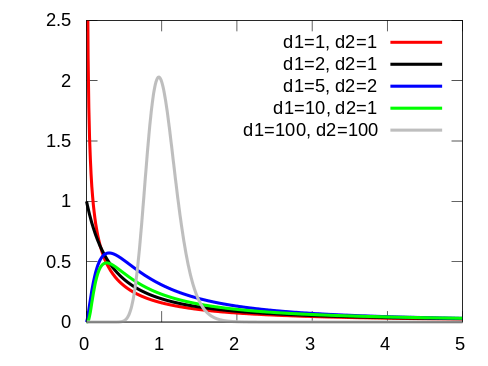
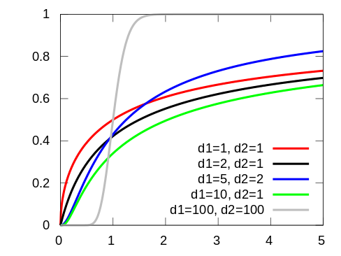
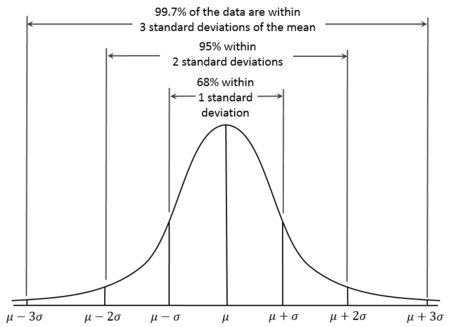
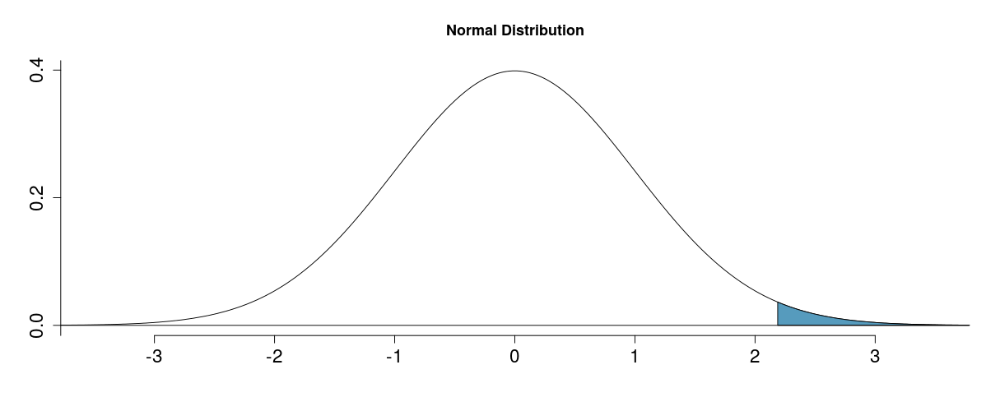
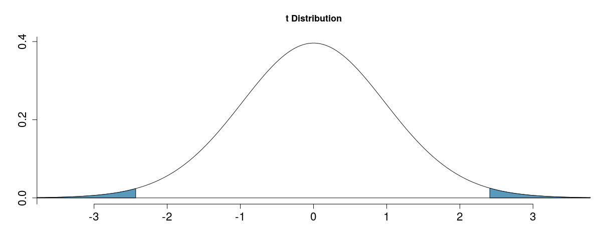
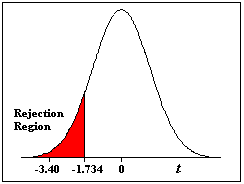
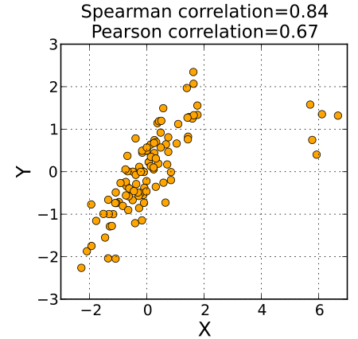

## Course Introduction 
> - Prelimitary  
> - 参数估计 (Parameter Estimate)  
    - 点估计 (Point Estimate)  
    - 置信区间 (Confidentce Interval)  
    - 样本均值和方差 (Sample Mean and Variance)  
> - 假设检验 (Hypothesis Test)  
    - $z$ Test  
    - $t$ Test (One sample，two samples，paired samples)  
> - 统计分析 (Statistical Analysis)  
    - 方差分析 (ANOVA)  
    - 回归分析 (Regression Analysis)    
    - 卡方检验 (Chi-Square Test)  
    - 秩和检验 (Rank Sum Test)  

--- .class #id

## Prelimitary Knowledge  
> - 中心极限定律 (Central Limit Theory)  
> - 采样分布 (Sampling Distribution)      
    - $\chi^2$ Distribution  
    - $t$ Distribution  
    - $F$ Distribution  

--- .bigger .center  
## Question?  
> 1. 如果你突然来到了小人国，让你预测小人国里的人的身高，你将怎么做呢？
> 2. 请预测下一个走出地铁站的人的年龄。 
  
  
  
  
  
> 3. 你会发现，我们经常用样本的均值来预测总体的均值。那为什么这么做是合理的呢？因为中心极限定律告诉我们样本均值的分布是正态分布，其均值就是总体均值，其方差和总体方差成正比且和样本点的个数成反比。  


--- .class #id
## 抽样分布  
让我们来看一下什么是抽样分布 (Sampling Distribution)  
  
  

抽样分布不是样本分布，抽样分布是指从总体中抽取一批样本，计算一个统计量例如均值，然后重复此过程得到该统计量的分布。

--- .class #id
## Central Limit Theory  
> - 中心极限定律可以认为是数理统计中最重要的定律  
> - 针对本课程内容来说，中心极限定律告诉我们：$iid (Identical\ Independent\ Distribution)$ 变量，其规范化（Normalized）均值，当样本数量足够多的情况下服从标准正态分布。 
    * $iid : X_1,X_2,...X_n$   
    * $\bar X = \frac{\sum_{i=1}^n x_i}{n}$  
    * $\frac{\bar X - \mu}{\sigma / \sqrt{n}} \sim N(0,1)$ 
    * $\sigma / \sqrt{n}$ 称为标准误差 (Standard Error)
    * $\bar X_n \sim N(\mu, \sigma^2 / n)$  
> - [https://gallery.shinyapps.io/CLT_mean/](https://gallery.shinyapps.io/CLT_mean/) 

--- .class    

## Example for CLT  
> - 在一个高犯罪率地区，长期统计显示平均每天抓到20个罪犯，标准差为3，现地区政府最高长官把作为警察局长的你叫来质问：一个月抓660个以上罪犯的可能性是多少？  
> - 由于监狱人满为患，典狱长私下问你：半年抓不超过3420个罪犯的可能性？
> - 解 1 ：根据题意，$总体均值 \mu=20，\sigma=3$ 。要求一个月抓660个罪犯以上，也就是说平均每天抓22个罪犯以上，如果我们把这个认为是随机采样的话，30个样本点的均值应符合正态分布 $N(20,9/30)$ (注意：这里的n=30是指30天).  
            那么，$\frac{(22-20)}{3/\sqrt{30}}=3.65$ ,这意味着22偏离均值3.65个标准差以上，根据正态分布经验法则99.7%的变量值是在3个标准差以内，显然这个可能性是小于0.003。  
> - 解 2 ：半年抓不超过3420个罪犯，也就是说平均每天少于等于19个罪犯  
            $\frac{(19-20)}{3/\sqrt{180}}=-4.47$  
            说明，即便只要求每天少一个，在180天的时间，这也几乎是不可能发生的事。  
> - 注意 ： 严格来讲，由于是连续取一个月的数据，并非真正随机采样，所以不符合中心极限定律条件。  


--- &twocol
## Chi-Square Distribution   
> - 如果  $(Z_1,Z_2,…,Z_k)$ 是一系列独立无关的标准正态分布随机变量，其平方和  
$V = \sum_{i=1}^k Z_i^2$ 符合自由度为 $k$ 的卡方分布      
$$V\thicksim \chi^2(k)$$  
$k$ 称为自由度 (degree of freedom)
> - 抽样定理1 : $X_1,X_2,...,X_n是总体N(\mu,\sigma^2)的样本,那么 (n-1)s^2/\sigma^2\sim\chi^2(n-1)$    
                其中 $s^2$ 是样本方差
*** =left  
> - 概率密度函数  
> -  

*** =right  
> - 累积分布函数  
> -  

--- &twocol  

## Student's t-distribution  
如果随机变量 $X \sim N(0, 1)$，$Y \sim \chi^2(n)$ 且独立无关,那么随机变量:  
$T=\dfrac{X}{\sqrt{Y/n}}$ 符合自由度为 $n$ 的 $T\thicksim t(n)$  

*** =left  
概率密度函数  
 
*** =right   
累积分布函数  
 

--- &twocol    
## Deep in T distribution

*** =left
```{r echo=F,warning=F,message=F}
library(ggplot2)
library(manipulate)
k <- 1000
xvals <- seq(-5, 5, length = k)
myplot <- function(df) {
    d <- data.frame(y = c(dnorm(xvals), dt(xvals, df)), x = xvals, dist = factor(rep(c("Normal", 
        "T"), c(k, k))))
    g <- ggplot(d, aes(x = x, y = y))
    g <- g + geom_line(size = 2, aes(colour = dist))
    g
}
manipulate(myplot(mu), mu = slider(1, 20, step = 1))
```

*** =right  
> - 抽样定理2  
如果 $ X_1,X_2,...,X_n $ 是总体 $N(\mu,\sigma^2)$ 的样本
$$ \frac{\bar X - \mu}{S/\sqrt{n}} \sim t(n-1) $$

--- &twocol    

## F Distribution  
如果 $U$ 和 $V$ 是独立无关的符合分别以 $r_1$ 和 $r_2$ 为自由度的卡方随机变量, 那么 : $ F=\dfrac{U/r_1}{V/r_2}$    
   符合参数为$r_1,r_2的F$分布， 
$$F\thicksim F(r_1,r_2)$$  

*** =left  
概率密度函数  
  

*** =right  
累积分布函数  


--- .class #id  

## Parameter Estimate    
参数估计 (Parameter   Estimation) 是指用样本指标 (称为统计量) 估计总体指标 (称为参数)   
- Point Estimate (点估计)     
- Confidence Interval (置信区间)    
- 参数估计方法  
    - 矩估计法    
    - 极大似然估计法   
    - 最小二乘法   
    - 贝叶斯估计法   

--- .class #id  

## 总体均值和方差   参数估计  
> - 样本均值  
    * $\bar X = \sum_{i=1}^n x_i p(x_i)$  
> - 样本方差  
    * $S^2 = \frac{\sum_{i=1} (X_i - \bar X)^2}{n-1}$  
> - 假设我们从经管之家CDA课程各期的报名人数记录中随机抽取8个，得到  
    {65，70，54，56，72，46，56，58}，请你猜测下一期报名人数及其波动性。   
> - 请你推测经管之家所有CDA课程各期报名人数的平均值。  
> - 可以看出来，我们经常用样本的均值来估算总体的均值（数学期望）。  因为随着样本数量的增加，样本统计量会越来越逼近于所对应的总体参数。
> - Question: 如果我们得到均值为60，预测下一期报名人数就是60，你认为它是绝对准确的吗？  

--- .class 
## Example first : confidence interval for mean  
你是一名体育比赛战术开发者，你正在制定一种新的橄榄球战术，新战术依赖于对手四分卫的身高，你采样55支橄榄球队四分卫身高得到平均值为185公分，标准差为1公分(标准差可认为是总体标准差)。你需要尽可能确认四分卫身高。
> - 你估计四分卫平均身高是多少？  
    点估计：$\bar{X}=185，\mu=185，\sigma=1$
> - 你真的知道就是这个值吗？  
    区间估计：根据CLT，我们知道 $\bar{X} \sim N(185,\frac{1}{55})$  
    根据正态分布的特性，我们知道95%的值出现在其均值距离2倍标准差之内。所以我们95%相信四分卫平均身高应该在:  
    $[185-2*1/\sqrt{55}\ ,\ 185+2*1/\sqrt{55}]$  
    当然，我们有5%的可能由于采样误差而犯错误，也就是说四分卫平均身高不在这个区间。  
> - 我们99.7%相信四分卫平均身高在：  
    $[185-3*1/\sqrt{55}\ ,\ 185+3*1/\sqrt{55}]$

--- &twocol  
## 总体均值的置信区间   
*** =left 
> - 置信区间是指由样本统计量所构造的总体参数的估计区间，它有两部分组成： 
    - 置信区间（Confidence Interval）：区间范围   
    - 置信水平（Confidence Level）：总体参数落在这个区间内的频率   
> - 置信区间 $ CI = Est \pm CV \times SE $, $SE$ 是Standard Error, $CV$ 是临界值  
> - 边缘误差 Margin Error : $ME = CV \times SE$
> - 根据CLT, 样本均值 $\bar X \sim N(\mu, \sigma^2 / n)$, 对 $\mu$ 的估计的置信区间为 $CI_\mu=\bar{X} \pm z^* \times \frac{\sigma}{\sqrt{n}}$
> - 定义置信水平(Confidence Level) = $1-\alpha,\ \alpha$ 表示我们的错误率

*** =right  
> - 
> - 均值正态分布置信区间 $ CI=\bar X\pm Z_{\alpha/2}\times SE$
> - 均值T分布置信区间 $CI=\bar X\pm T_{\alpha/2}\times SE$
> - 常用置信水平: 90%，95%，99%


--- .class #id
## Hypothesis Testing (假设检验)  
> - 假设检验是关于用数据进行决策的理论。  
> - 一般会比较两个假设  
    * $ H_0 $ : 空假设    nothing happened  
    * $ H_1 $ : 备选假设  something happened 
> - 我们给定显著性水平 $\alpha$ ，即犯错误的可能性。   
> - 我们假定$ H_0 $为真的情况下，出现数据所呈现的情况或更极端情况的概率 (P-Value)，如果该概率非常小（$p<\alpha$），认为数据提供了足够证据支持$H_1$，我们就选择$H_1$，否则我们选择$H_0$。  
> - $H_0:\ \mu\ =\mu_0$  
    $H_1:\ \mu\ \ne\mu_0$    (two-tailed)  
    $H_1:\ \mu\ >\mu_0$    (upper-tailed)  
    $H_1:\ \mu\ <\mu_0$    (lower-tailed)  


--- &twocol
## P Value
*** =left

*** =right
P value就是在 $H_0$ 的情况下，得到所观察到的值和更为极端的值的概率。  
$$
Pvalue=P\{观察值或更为极端的值出现|H_0为真\}
$$
Right Tail:
$$
Pvalue=P(X\ge x|H)
$$
Left Tail:
$$
Pvalue=P(X\le x|H)
$$
Pvalue越小，说明越具有统计显著性。

--- &twocol
## $z$检验 ($U$检验)  
Question:  
  一学校校长声称其学校学生具有较高的智商。从其学校随机采样30个学生得IQ均值为106。(总体成正态分布，均值为100，标准差为15)。你认为他是否在吹牛？  

*** =left  
> - Step 1 : 给出假设   
    * $ H_0 : u = 100 $  
    * $ H_1 : u > 100 $  
> - Step 2 ：构造统计量  
    - $Z^*=\frac{\bar X - \mu}{\sigma /\sqrt{n}} = \frac{106 - 100}{15/\sqrt{30}}=2.19$  
> - Step 3 : 确定显著性水平并得到p-value  
    * $ \alpha = 0.05 $ 
    * P-Value = 0.014
*** =right
> - Step 4 : 比较 P-Value 与 $\alpha$ 而得出结论  
    * p value < $\alpha$
    * 拒绝0假设，而选择备选假设。 
> - P Value  = 随机采样30个学生平均IQ $\ge$ 106的概率，如果该学校学生智商和总体没有差别。
   

--- &twocol
## $t$检验 One Sample  
一个产品经理刚刚为其产品上线了新功能，他想通过用户滞留时间来判断是否对用户体验有影响(需要98%肯定），该产品用户平均滞留时间为15.5秒，小范围用户测试后采样36个用户得到新的平均滞留时间为13.5秒，方差为25秒。你能帮助他吗？
*** =left
> 1. $ H_0 : \mu = 15.5 $  
     $ H_1 : \mu \neq 15.5 $  
> 2. $\frac{\bar X - \mu}{S/\sqrt{n}} = \frac{13.5 - 15.5}{5/\sqrt{36}} = -2.4 $  
     $df = 36-1$  
> 3. $ P\ value = 0.011*2 $  
> 4. $ \alpha = 0.02 < P $  
> 5. 我们接受$H_0$假设 : 新功能对用户体验没有显著影响（在0.02的显著性水平下）。  

*** =right
> - P Value  
    


--- &twocol  
## $t$ test Paired Sample  
> - 采样200名学生，分别测试其阅读能力和写作能力  
*** =left  
> -   
> - 学生的阅读能力和写作能力是否有显著差异呢？ 

*** =right  
> -  

--- &twocol  
### (接上例)  
*** =left
$H_0 : \mu_{diff} = 0$   
$H_1 : \mu_{diff} \neq 0$  
> 1. $\bar x_{diff} = -0.545$  
    $s_{diff} = 8.887$  
    $n_{diff} = 200$  
> 2. $t^*=\frac{-0.545-0}{8.887/\sqrt{200}}=-0.867$  
    $df=200-1=199，\alpha=0.05$
> 3. P value = $0.193*2> \alpha$  
> 4. 所以我们接受$H_0$ : 没有足够的证据说明学生阅读和写作能力有显著差异。

*** =right
> - P Value  


--- .class #id  
### Think of P value again  
下面哪一个是P value的正确解释  
> 1. 写作和阅读的平均成绩相同的概率  
> 2. 写作和阅读的平均成绩不同的概率  
> 3. 如果实际上写作和阅读平均成绩没有不同，那么采样200的学生，得到其阅读和写作成绩差至少为0.545（两个方向）的概率。  
> 4. 如果$H_0$为真，错误拒绝$H_0$的概率。  

--- .class #id  
## 抽样定理 3       
$\{X_1,X_2,...,X_{n_1}\}与\{Y_1,Y_2,...Y_{n_2}\}$ 分别是具有相同方差的两正态分布$N(\mu_1,\sigma^2)$ , $N(\mu_2,\sigma^2)$ 的样本，且这两个样本相互独立，则有  
$$
 \frac{(\bar X - \bar Y)-(\mu_1-\mu_2)}{S_p\sqrt{\frac{1}{n_1}+\frac{1}{n_2}}}\sim t(n_1+n_2-2)
$$
其中
$$
  S_p^2 = \frac{(n_1-1)S_1^2+(n_2-1)S_2^2}{n_1+n_2-2} 
$$

--- &twocol    
## Example $t$ 检验 two samples 
某公司新采购了一批打包机器，希望检测一下新机器是否比旧机器的打包速度更快，数据如下，你是否可以帮助他们得出结论？
*** =left  
```{r echo=F,warning=F,message=F}
machine <- read.csv("./machine.txt",sep='\t',header=TRUE)
library('knitr')
kable(machine, format = "markdown")
```
$\hat{X_1} = 42.14, s_1 = 0.683$  
$\hat{X_2} = 43.23, s_2 = 0.750$  
*** =right  
> - Step 1 :  
    * $H_0 : \mu_1=\mu_2$  
    * $H_1 : \mu_1 < \mu_2$  
> - Step 2 :  
    * $s_p= \sqrt{\frac{9\cdot (0.683)^2+9\cdot (0.750)^2}{10+10-2}}=0.717$  
> - Step 3 :  
    * $df = 10 + 10 - 2=18$  
> - Step 4 :  
    - $t^{*}=\frac{({\bar{x}}_1-{\bar{x}}_2)-0}{s_p \sqrt{\frac{1}{n_1}+\frac{1}{n_2}}}=\frac{42.14-43.23}{0.717\cdot \sqrt{\frac{1}{10}+\frac{1}{10}}}=-3.40$ 

--- &twocol  
## (接上例) 
*** =left  
> - 
> - Step 5 : 
    * $-t_{\alpha} = -1.734$
    * P-value $=0.0016$  
> - Step 6 :   
    * 在 $\alpha$ 为0.05的显著性水平下，我们拒绝$H_0$ 而接受 $H_1$  

*** =right  
> - Confidence Interval  
    * CI : ${\bar{x}}_1-{\bar{x}}_2\pm t_{\alpha/2}\cdot s_p\cdot \sqrt{\frac{1}{n_1}+\frac{1}{n_2}}$  
> - $\alpha = 0.05$ :  
    * $-t_{0.05/2} = -2.1$
    * $CI=(-1.76,-0.41)$  
> - $\alpha = 0.01$ :   
    * $-t_{0.01/2} = -2.878$
    * $CI=(-2.013, -0.167)$    

--- .class #id
## Decision errors 
> -   
> - Type 1 error & Type 2 error  
    * Type 1 error : $H_0$为真，但我们拒绝了$H_0$  
    * Type 2 error : $H_1$为真，但我们接受了$H_0$  

--- &twocol  
## Blancing error rates  

*** =left
> -   
  
*** =right 

> - 法庭审判  
    * $H_0$: 嫌疑人是无辜的  
    * $H_1$: 嫌疑人是有罪的  
> - Question : Type 1 or 2 error, Which one is worse?
> - Question: 为什么我们不一直采用99%的置信水平？  

--- .class #id
## Question?
到现在为止，我们已经知道了如何构造置信区间和进行假设检验以辅助决策。可我们基本上都是围绕着均值的，如果我们想了解中位数的置信区间又该如何呢？  

> - Bootstrapping !

--- &twocol

## Question?  

*** =left  

> - 考虑  
  $Significant Level+Confidence Level =?$  

*** =right  

> - 其他条件都一样，一个样本集大小为100，另一个为10000.  
> - 哪一个得出的P-value更小呢？  

--- .class #id
## Anova ( 方差分析 )  
> - Basic Conception  
> - F-statistics and F-test  
> - Condition   
> - Example  

--- &twocol
## Example First  

*** =left 

```{r echo=F,warning=F,message=F}
#m <- matrix(scan("../data/gear.dat",skip=25),ncol=2,byrow=T)
#diameter = m[,1]
#batch = as.factor(m[,2])
#datafilename="http://personality-project.org/R/datasets/R.appendix1.data"
#data.ex1=read.table(datafilename,header=T) 
#aov.ex1 = aov(Alertness~Dosage,data=data.ex1)  #do the analysis of variance
#summary(aov.ex1) 
x <- read.csv("../data/anova.csv",header=T,sep=",")
library(data.table)
dt <- data.table(x)
ct <- dt[,list(mean=mean(Expression),sd=sd(Expression)),by=Subtype]
kable(head(dt),format="markdown")
```
- 我们想知道不同的Subtype对Expression有影响吗？你的看法呢？  
```{r echo=F}
kable(ct,format="markdown")
```
*** =right
> -  
```{r echo=F,message=F,warning=F}
boxplot(Expression~Subtype,data=x)
```

--- .class #id  

## Basic conception of Anova  
> - 方差分析可以用来衡量多个均值是否一致。
    * 比较多个组的均值，看它们是否相差很远，且不能完全由采样误差来解释。  
    * 可用来衡量某个因素对实验结果的影响。 
    * 衡量分类变量和数值变量的关系  
> - F statistics = $\frac{Variability\ Between\ Groups}{Variability\ within\ groups}$  
    * 条件：方差齐性  
> - 单因素和多因素方差分析  
> - Variability Partitioning   

--- &twocol 
## ANOVA Explain

*** =left
> 总离差平方和 ( Sum of Squares Total )
> 测量总的变异 ( Variability )  
$y_i$: 响应变量的值  
$\bar{y}$: 响应变量总均值    
$$ SST =  \sum_{i=1}^{n}{(\bar{y}-y_i)^2} $$
  
  
> 组间离差平方和 ( Sum of Squares Group )  
> 测量组间变异 ( Variability )  
$n_j$: number of observations in group j  
$\bar{y_j}$: mean of response variable for group j
$$ SSG =  \sum_{j=1}^{k}{n_j(\bar{y_j}-\bar{y})^2} $$ 

*** =right
> 组内离差平方和 （ Sum of Squares Error )  
> 测量组内变异
$$ SSE = SST - SSG $$  
  
> 组内/组间平均波动性  
组间平均：$MSG = \frac{SSG}{df_G},df_G = k-1$    
组内平均: $MSE = \frac{SSE}{df_E},df_E = df_T-df_G$  
$df_T=n-1$  


--- .class #id
## 方差分析表  
```{r echo=F,warning=F,message=F}
a = aov(Expression~Subtype, data=x)
summary(a)
``` 
  
table|df|Sum Sq|Mean Sq|F Value|Pr(>F)
---|---|---|---|---|---
Subtype|2|4.75|2.3769|3.991|0.0196
Residuals|278|165.59|0.5965

$$
\frac{MSG}{MSE} \sim F(k-1,n-k)
$$

--- .class #id
## Condition for Anova  
> 1. 无关性   
    * within groups  
    * between groups  
> 2. 各组内数值成正态分布或接近正态分布  
> 3. 方差齐性 ：各组的方差一致  

--- .class #id

## Question?  
我们通过方差分析判断出至少一对均值差距显著，那么是哪一对呢？
> - Multiple comparisions  
> - Type 1 Error inflating  
> - Bonferroni Correction  
    * Adjusted $\alpha = \alpha / K $  
    * $K=\frac{k(k-1)}{2}$ 
> - Tukey's Test  
    $q_s=\frac{\hat{y}_{max}-\hat{y}_{min}}{SE}$

--- .class #id
## 分类变量统计检验  
> - One Category Variable  
    * 2 levels  
    * More than 2 levels  
> - two Category Variables  
    * 2 levels  
    * More than 2 levels  
> - CLT on Proportion
> - Chi-Squared Test

--- .class #id  
## Example for Sampling Distribution on Proportion  
  

--- .class #id
## CLT for Proportions  
  
$$
\widehat{p} \sim N(mean=p,SE=\sqrt{\frac{p(1- p)}{n}})
$$
> - Conditions  
    1. Independence  
    2. Sample size/skew: $np > 10$ and $n(1-p) > 10$  

--- .class #id

## Examples for CLT on Proportions  
某电影学院女生90%都是美女，如果你随便采样200个，其中超过190人是美女的概率是多少？  

> - $p = 0.9,n=200$  
> - $P(\widehat{p}>0.95)=？$  
> - $\widehat{p} \sim N(mean=0.9,SE=\sqrt{\frac{0.9(1- 0.9)}{200}}=0.0212)$

--- &twocol  
## Examples for CI and HT on proportion  
2013年，调查1983个人得出60%的美国人相信进化论。   
*** =left  
> - 这个数据是否提供了令人信服的证据说：60%的美国人相信进化论。  
> - $H_0 : p = 0.5$  
    $H_1 : p > 0.5$  
> - $\widehat{p}=0.6$  
    $n=1983$  
> - $SE=\sqrt{\frac{0.5*0.5}{1983}}=0.0112$
    $Z=\frac{0.6-0.5}{0.0112}=8.92$  
    P value is almost 0  
> - 我们拒绝$H_0$，而接受$H_1$  

*** =right
> - 对于60%这个比例，95%的置信区间是什么？
> - $\alpha=0.05$  
    $CI=\widehat{p} \pm z^* \times SE_{\widehat{p}}$  
      $=0.6 \pm 1.96 \times \sqrt{\frac{\widehat{p}(1- \widehat{p})}{n}} $   
> - $CI = (0.578,0.622)$  

--- &twocol
## Two Proportions  
*** =left
假如民意调查显示1028个人中，257个人认为应该对研发人员退税。而调查经管之家的学员83人中，59个认为应该退税。我们希望知道两组人的比例的区别是什么？  
```{r echo=F,warning=F,message=F}

```

Suc|n|p|g  
---|---|---|---  
257|1028|0.25|Nation  
59|83|0.71|Jing    

*** =right
> - Prameter of interest: $p_{nation}-p_{jing}$  
> - Point estimate: ${\hat{p}}_{nation}-{\hat{p}}_{jing}$  
> - Confidence interval:  
    Point estimate $\pm Margin\ errors$  
    $=(\hat{p_1}-\hat{p_2}) \pm Z^* \times SE_{(\hat{p_1}-\hat{p_2})}$  
    
> - $SE_{(\hat{p_1}-\hat{p_2})} = \sqrt{\frac{\hat{p_1}(1-\hat{p_1})}{n_1}+\frac{\hat{p_2}(1-\hat{p_1})}{n_2}}$  
> - 在 $\alpha=0.05$ 的条件下    
    $CI = 0.46 \pm 0.1$

--- .class #id  

## Chi-Square GOF test  
陪审员的选择应该是随机的，一个国家的民间组织质疑这一点，认为有种族歧视存在，你作为一个数据分析专家介入调查，你将怎么做呢?  
```{r}

```
ethnicity|white|black|nat.amer.|asia|others
---|---|---|---|---|---
%in population|80.29%|12.06%|0.79%|2.92%|3.94%
observed#|1920|347|19|84|130  

> - $H_0$ : 没有种族歧视，陪审员的各种族比例和各种族在人口总数的比例是一致的。   
    $H_1$ : 存在种族歧视，陪审员的分布和各种族的分布是不一致的。  
> Good of Fit Test  

--- .class #id  
### （接上例）  
ethnicity|white|black|nat.amer.|asia|others|total
---|---|---|---|---|---|---
%in population|80.29%|12.06%|0.79%|2.92%|3.94%|100%
expected #|2007|302|20|73|98|2500
observed #|1920|347|19|84|130|2500  

> - 我们需要检查实际的观察计数和期望的计数是否相差很多。  
> - 这里我们引入卡方检验  
$$ \chi^{2*}=\sum_{i=1}^k (O_i-E_i)^2/E_i,df = k -1, k = 5$$  
> -  
$\chi^{2*}=\frac{(1920-2007)^2}{2007}+\frac{(302-347)^2}{347}+\frac{(20-19)^2}{19}+\frac{(73-84)^2}{84}+\frac{(98-130)^2}{130}=22.63$  
> - p-value = 0.0002 < $\alpha$, $\alpha = 0.05$     
> - 我们拒绝原假设，得出结论：数据提供了足够证据说明人口种族分布和陪审员在各种族的分布是不一致的。   

--- .class #id
## Chi-Square Independent Test  
我们来检查一下共和党和民主党和受支持程度分类的关系.  
  
  
$H_0 : 共和党和民主党与受支持程度的分类没有关系$    
$H_1 : 共和党和民主党与受支持程度的分类存在关系$  
  
  
  
groups|favor|indifferent|opposed|total
---|---|---|---|---
democrat|138|83|64|285
republican|64|67|84|215
total|202|150|148|500  

--- .class #id
## (接上例)  
计算期望计数  

groups|favor|indifferent|opposed|total
---|---|---|---|---
democrat|$\frac{285*202}{500}=115.14$|$\frac{285*150}{500}=85.5$|$\frac{285*148}{500}=84.36$|285
republican|$\frac{215*202}{500}=86.86$|$\frac{215*150}{500}=64.5$|$\frac{215*148}{500}=63.64$|215
total|202|150|148|500
  

$\chi^{2*}=\frac{(138-115.14)^2}{115.14}+\frac{(83-85.50)^2}{85.50}+\frac{(64-84.36)^2}{84.36}+\frac{(64-86.86)^2}{86.86}+\frac{(67-64.50)^2}{64.50}+\frac{(84-63.64)^2}{63.64}=22.152$  
  
$df=(ncols-1)(nrows -1)=2$  
p-values = 0.000  
我们的结论是？  

--- .class #id
## Regression Analysis  
- Basic Conception  
- Correlation  
- Modeling Diagnostics  
- Inference  

--- .class #id  
## 回归分析基本概念  
- 一般来说，回归分析通常用来分析两个数值变量的线性关系。   
- 线性回归和非线性回归  
- 单变量回归和多变量回归  
- Question: 回归分析是否可以用来分析分类变量和数值变量的关系？    

--- &twocol
### 原始的回归问题  
  
*** =left
> - A famous motivating example  
> -   

*** =right 
> - The Galton Data  
```{r echo=F}
library(UsingR)
data(galton)
kable(head(galton,4), format = "markdown")
```
> - 用父母的身高来预测孩子的身高  
> - 用一种稳定，易于描述的模型来表示父母身高的均值和孩子身高均值的关系  
> - 调查孩子身高的波动性不能由父母身高波动性来解释的部分。  
> - 为什么非常高的父母孩子也会非常高，但一般会比父母矮一点；而非常矮的父母的孩子也会比较矮，但会比其父母要高一点。  

--- .class #id
##  Comparing the Histogram  
```{r echo=F,warning=F,message=F}
library(UsingR); data(galton); library(reshape2); long <- melt(galton)
g <- ggplot(long, aes(x = value, fill = variable)) 
g <- g + geom_histogram(colour = "black", binwidth=1) 
g <- g + facet_grid(. ~ variable)
g
```

--- &twocol  
## Regression   
*** =left 
> -
```{r freqGalton, dependson="galton",fig.height=6,fig.width=7,echo=FALSE,warning=F,message=F}
library(dplyr)
freqData <- as.data.frame(table(galton$child, galton$parent))
names(freqData) <- c("child", "parent", "freq")
freqData$child <- as.numeric(as.character(freqData$child))
freqData$parent <- as.numeric(as.character(freqData$parent))
g <- ggplot(filter(freqData, freq > 0), aes(x = parent, y = child))
g <- g  + scale_size(range = c(2, 20), guide = "none" )
g <- g + geom_point(colour="grey50", aes(size = freq+20, show_guide = FALSE))
g <- g + geom_point(aes(colour=freq, size = freq))
g <- g + scale_colour_gradient(low = "lightblue", high="white")                    
g
```
*** =right
> -  
```{r, fig.height=6,fig.width=6,echo=FALSE,warning=F,message=F}
g <- ggplot(filter(freqData, freq > 0), aes(x = parent, y = child))
g <- g  + scale_size(range = c(2, 20), guide = "none" )
g <- g + geom_point(colour="grey50", aes(size = freq+20, show_guide = FALSE))
g <- g + geom_point(aes(colour=freq, size = freq))
g <- g + scale_colour_gradient(low = "lightblue", high="white")  
g <- g + geom_smooth(method="lm", formula=y~x)
g
```  

--- .class #id  
## Correlation Coefficient 
Pearson Correlation Coefficient  
$$ Cor(x,y)=R=\frac{\sum_{i=1}^{n}(x_i-\bar{x})(y_i-\bar{y})}{\sqrt{\sum_{i=1}^{n}(x_i-\bar{x})^2\sum_{i=1}^{n}(y_i-\bar{y})^2}} $$
- 描述两个变量线性相关的强度  
- 正负代表相关的方向  
- 区间[-1,1]，0代表不相关    
- 无单位，不随变量中心化或尺度变换而改变  
- $Cor(x,y) = Cor(y,x)$  
- 受异常值影响较大   

--- .class #id
## Correlation of determination  
   
- total sum of squares  
$SS_{tot} =  \sum_{i}{(y_i-\bar{y})^2}$  
- explained sum of squares  
$SS_{reg} =  \sum_{i}{(f_i-\bar{y})^2}$ 
-  residual sum of squares   
$SS_{res} =  \sum_{i}{(y_i-f_i)^2}$
-  The most general definition of the coefficient of determination  
$R^2  = 1- \frac{SS_{res}}{SS_{tot}}$ 

--- &twocol 
## R squared  
*** =left  
$$
R^2 = \frac{\sum_{i=1}^n  (\hat Y_i - \bar Y)^2}{\sum_{i=1}^n (Y_i - \bar Y)^2}
$$
> - Between (0,1)  
> - 描述了有百分之多少的响应变量的波动性可以由这个模型解释。
> - 删除数据总会膨胀 $R^2$
> - 增加预测变量总会增大 $R^2$ 
> - Adjusted $R^2$

*** =right 
> -  
```{r, echo = FALSE, fig.height=5, fig.width=5, results='hide'}
require(stats); require(graphics); data(anscombe)
ff <- y ~ x
mods <- setNames(as.list(1:4), paste0("lm", 1:4))
for(i in 1:4) {
  ff[2:3] <- lapply(paste0(c("y","x"), i), as.name)
  ## or   ff[[2]] <- as.name(paste0("y", i))
  ##      ff[[3]] <- as.name(paste0("x", i))
  mods[[i]] <- lmi <- lm(ff, data = anscombe)
  #print(anova(lmi))
}


## Now, do what you should have done in the first place: PLOTS
op <- par(mfrow = c(2, 2), mar = 0.1+c(4,4,1,1), oma =  c(0, 0, 2, 0))
for(i in 1:4) {
  ff[2:3] <- lapply(paste0(c("y","x"), i), as.name)
  plot(ff, data = anscombe, col = "red", pch = 21, bg = "orange", cex = 1.2,
       xlim = c(3, 19), ylim = c(3, 13))
  abline(mods[[i]], col = "blue")
}
mtext("Anscombe's 4 Regression data sets", outer = TRUE, cex = 1.5)
par(op)
```  

--- .class #id  
## Fitting the best line
* 令$Y_i$ 是第 $i^{th}$ 孩子的身高，且 $X_i$ 是第 $i^{th}$ 父母的身高. 
* 考虑如何找到最佳匹配线   
  * Child's Height = $\beta_0$ + Parent's Height $\beta_1$
* 最小二乘法 least squares
  $$
  \sum_{i=1}^n \{Y_i - (\beta_0 + \beta_1 X_i)\}^2
  $$  

--- .class #id  
## OLS solution for regression    
- 采用最小二乘法匹配 $Y = \beta_0 + \beta_1$ 得到  
  $Y = \hat \beta_0 + \hat \beta_1 X$ ，这里  
  $$\hat \beta_1 = Cor(Y, X) \frac{Sd(Y)}{Sd(X)} ~~~ \hat \beta_0 = \bar Y - \hat \beta_1 \bar X$$
- $\hat \beta_1$ 的单位是 $Y / X$, $\hat \beta_0$ 的单位是 $Y$.
- 这条直线通过点 $(\bar X, \bar Y$)
- 如果经过数据规范化, $\{ \frac{X_i - \bar X}{Sd(X)}, \frac{Y_i - \bar Y}{Sd(Y)}\}$, 斜率为 $Cor(Y, X)$.  
- 就Galton Data而言，  
  斜率 = 0.6434   
  截距 = 23.94  

--- .class #id  
## The Linear Model  
> - 基本线性模型  
$$
Y_i = \beta_0 + \beta_1 X_i + \epsilon_{i}
$$
* 这里 $\epsilon_{i}$ 被认为是 iid $N(0, \sigma^2)$. 
* $E[Y_i ~|~ X_i = x_i] = \mu_i = \beta_0 + \beta_1 x_i$
* $Var(Y_i ~|~ X_i = x_i) = \sigma^2$. 
* Residual : $e_i=y_i-\hat{y}_i$

--- .class #id   
## A little bit deeper into linear model 
1966年，Cyrit Burt发表了一篇论文题为：基因决定智商。根据对27对双胞胎分别由养父母和亲生父母抚养的研究数据。  
  

--- &twocol    
## （接上例)  
回归分析结果  
  
None|Estimate|Std.Error|t value|Pr
---|---|---|---|---
(Intercept)|9.2076|9.2999|0.99|0.3316
bioIQ|0.9014|0.0963|9.36|0.0000  

*** =left  
> - $\widehat{fosterIO}=9.2076+0.9014\times bioIQ $  
> - $R^2=0.78$  
> - 对斜率进行统计检验  
    * $H_0 : \beta_1 = 0$  
    * $H_1 : \beta_1 \ne 0$  
> - $t=\frac{\hat{\beta_1}-0}{SE_{\hat{\beta_1}}} = \frac{0.9014-0}{0.0963} = 9.36$
> - $df=27-2=25$
> - P value = 0.000  

*** =right  
> - 计算95%置信区间:$\hat{\beta_1}$    
    * ${t^*}_{25} = 2.06$ 
> - $CI=0.9014 \pm 2.06 \times 0.093 = (0.7,1.1)$    

--- .class #id  
## Conditions for linear regression  
> - Linearity  
> - Near normal residuals  
> - Constant variability  
> - Model diagnostic  
[https://gallery.shinyapps.io/slr_diag](https://gallery.shinyapps.io/slr_diag)  

--- .class #id  
## Regression with categorial variable  
例如，我们用地域来预测贫穷百分比    
> - 解释变量是region  
    * east ：0 （Reference Level）  
    * west : 1  
> - $\widehat{poverty}=11.17+0.38\times region:west$  

--- .class 
## 统计检验总结  

- $z$ 检验用来检验单样本均值与总体均值的距离是否具有统计显著性（总体方差已知）  
- 单样本 $t$ 检验如同 $z$ 检验，只是总体方差未知  
- 双样本 $t$ 检验用来检查样本均值差与总体均值差的距离  
- 成对 $t$ 检验用来检查成对数据均值差与总体均值差的距离  
- 方差分析用来检验按照因素划分的多个样本的均值是否相等
- 卡方检验用来检查分类变量之间的关系  
- 回归分析用来检查多个变量与一数值变量之间的线性关系  
- CLT on Mean 给出了样本均值的抽样分布。
- CLT on Proportion 给出了二分类变量的某一分类所占比例的抽样分布。 


--- .class #id  
## Option 1 : Rank Sum test
现在我们接触的假设检验大部分都要求变量成正态分布或近似正态分布，如果这个条件不能满足或样本数非常小，又如何呢？  
考虑如下问题：  
   有两个球队，我们想要检验其年平均的进球数是否近似。  
Team A : 6, 8, 2, 4, 4, 5  
Team B : 7, 10, 4, 3, 5, 6
```{r warning=F,message=F}
a = c(6, 8, 2, 4, 4, 5)
b = c(7, 10, 4, 3, 5, 6)  
wilcox.test(b,a, correct=FALSE)
```   

--- .class #id

## Option 2 : Homogeneity of variance test  
Levene's test   
> - $H_0:\sigma_{1}^{2} = \sigma_{2}^{2} = \ldots = \sigma_{k}^{2}$  
    $H_1:\sigma_{i}^{2} \ne \sigma_{j}^{2}$  
> - $Z_{ij} = |Y_{ij} - \bar{Y}_{i.}|$,where $\bar{Y}_{i.}$ is the mean of the i-th subgroup.  
    $Z_{ij} = |Y_{ij} - \tilde{Y}_{i.}|$,where $\tilde{Y}_{i.}$ is the median of the i-th subgroup.    
    $Z_{ij} = |Y_{ij} - \bar{Y}_{i.}'|$,where $\bar{Y}_{i.}'$ is the 10% trimmed mean of the i-th subgroup.    
> - $W = \frac{(N-k)} {(k-1)}\frac{\sum_{i=1}^{k}N_{i}(\bar{Z}_{i.}-\bar{Z}_{..})^{2} }{\sum_{i=1}^{k}\sum_{j=1}^{N_i}(Z_{ij}-\bar{Z}_{i.})^{2} }$  
  
> - 拒绝域： $W>F_{\alpha,k-1,N-k}$  

--- .class #id  
## Option 3 : Why $R^2$ is the Square of $r$ 
$$
\begin{align}
\sum_{i=1}^n (Y_i - \bar Y)^2 
& = \sum_{i=1}^n (Y_i - \hat Y_i + \hat Y_i - \bar Y)^2 \\
& = \sum_{i=1}^n (Y_i - \hat Y_i)^2 + 
2 \sum_{i=1}^n  (Y_i - \hat Y_i)(\hat Y_i - \bar Y) + 
\sum_{i=1}^n  (\hat Y_i - \bar Y)^2 \\
\end{align}
$$  

--- .class #id 
## 
Recall that $(\hat Y_i - \bar Y) = \hat \beta_1  (X_i - \bar X)$
so that
$$
R^2 = \frac{\sum_{i=1}^n  (\hat Y_i - \bar Y)^2}{\sum_{i=1}^n (Y_i - \bar Y)^2}
= \hat \beta_1^2  \frac{\sum_{i=1}^n(X_i - \bar X)^2}{\sum_{i=1}^n (Y_i - \bar Y)^2}
= Cor(Y, X)^2
$$
Since, recall, 
$$
\hat \beta_1 = Cor(Y, X)\frac{Sd(Y)}{Sd(X)}
$$
So, $R^2$ is literally $r$ squared.  

--- &twocol
## Option 4 : Permutation Test
*** =left
置换检验，是Fisher提出的一种基于大量计算（computationally intensive），利用样本数据的随机排列（置换检验的核心思想，故名Permutation test），进行统计推断的方法。因其对总体分布自由，特别适合用于总体分布未知的小样本数据，以及一些常规方法难以使用的假设检验情况。  
如果我们需要比较两组数据的均值，但采样样本非常小，又或是比较其他统计量。也就是说不能直接使用中心极限定律，如何解决呢？  
  
  
A = {24,43,58,67,61,44,67,49,59,52,62,50}  
B = {42,43,65,26,33,41,19,54,42,20,17,60,  
    37,42,55,28}  
  
$\hat{X}_A-\hat{X}_B = 14$

```{r echo=F,warning=F,message=F}
a<-c(24,43,58,67,61,44,67,49,59,52,62,50,42,43,65,26,33,41,19,54,42,20,17,60,37,42,55,28)
group<-factor(c(rep("A",12),rep("B",16)))
data<-data.frame(group,a)
#kable(head(data,5),format="markdown")
find.mean<-function(x){
mean(x[group=="A",2])-mean(x[group=="B",2])
}
```

*** =right
```{r echo=F,warning=F,message=F}
results<-replicate(999,find.mean(data.frame(group,sample(data[,2]))))
p.value<-length(results[results>mean(data[group=="A",2])-mean(data[group=="B",2])])/1000
hist(results,breaks=20,prob=TRUE,col="lightblue")
lines(density(results))
abline(v=14,col="red",lwd=2)
```

--- &twocol
## Option 5 : Power
*** =left
> - Power is the probability of rejecting the null hypothesis when it is false
> - A type II error rate is $\beta$
> - $Power = 1 - \beta$ 
> - $P\left(\frac{\bar X - \mu}{s /\sqrt{n}} > t_{1-\alpha,n-1} ~|~ \mu = \mu_a \right)$
> - Power doesn't need $\mu_a$, $\sigma$ and $n$, instead only $\frac{\sqrt{n}(\mu_a - \mu_0)}{\sigma}$
> - The quantity $\frac{\mu_a - \mu_0}{\sigma}$ is called the effect size  
> - Cohen's d

*** =right
> -  
```{r echo=F,warning=F,message=F}
library(manipulate)
mu0 = 30
myplot <- function(sigma, mua, n, alpha) {
g = ggplot(data.frame(mu = c(27, 36)), aes(x = mu))
g = g + stat_function(fun = dnorm, geom = "line", args = list(mean = mu0,
sd = sigma/sqrt(n)), size = 2, col = "red")
g = g + stat_function(fun = dnorm, geom = "line", args = list(mean = mua,
sd = sigma/sqrt(n)), size = 2, col = "blue")
xitc = mu0 + qnorm(1 - alpha) * sigma/sqrt(n)
g = g + geom_vline(xintercept = xitc, size = 3)
g
}
manipulate(myplot(sigma, mua, n, alpha), sigma = slider(1, 10, step = 1, initial = 4),
mua = slider(30, 35, step = 1, initial = 32), n = slider(1, 50, step = 1,
initial = 16), alpha = slider(0.01, 0.1, step = 0.01, initial = 0.05))
```

--- &twocol
## Option 6.1 : Spearman Rank of Coefficient

*** =left
Spearman相关系数定义为变量的秩(Rank)的Pearson相关系数。  
$\rho_{rg_X,rg_Y} = \frac{cov(rg_X,rg_Y)}{\sigma_{rg_X}\sigma_{rg_Y}}$  


*** =right

$r_s=1-\frac{6\sum{d_i^2}}{n(n^2-1)}$  
$d_i=rg(X_i)-rg(Y_i)$

--- &twocol
## Option 6.2 : Kendall Rank Coefficient

*** =left
Kendall $\tau$ 相关系数用来评价两个顺序变量的相关程度。  
$$
\tau_A=\frac{n_c-n_d}{n_0}
$$

*** =right

***--- .class #id
## 抽样定理1的直观解释  
我们知道

--- .class #id
## Options 7 : 抽样定理2的证明
因为  
$$
\frac{\bar{X}-\mu}{\sigma/\sqrt{n}}\sim N(0,1),\   \frac{(n-1)S^2}{\sigma^2}\sim \chi^2(n-1)
$$
根据t分布定义：  
$$
\frac{\bar{X}-\mu}{\sigma/\sqrt{n}}/\sqrt{\frac{(n-1)S^2}{(n-1)\sigma^2}}\sim t(n-1)
$$
化简左边可得抽样定理 2 

***--- .class #id
## 抽样定理 3 的直观解释
由 $\bar{X}\sim N(\mu_1,\sigma^2/n_1), \bar{Y}\sim N(\mu_2,\sigma^2/n_2)$  且 $X,Y$ 独立  
那么 $\bar{X}-\bar{Y} \sim N(\mu_1-\mu_2,\frac{\sigma^2}{n_1}+\frac{\sigma^2}{n_2})$
即


